2009年3月，奥比岛推出玩法“寻找26个字母”。玩家需要在奥比岛上找到26个字母宝石。

^

| 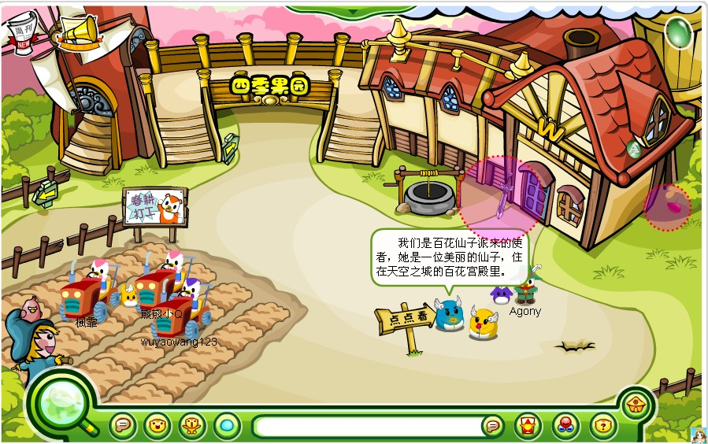 | 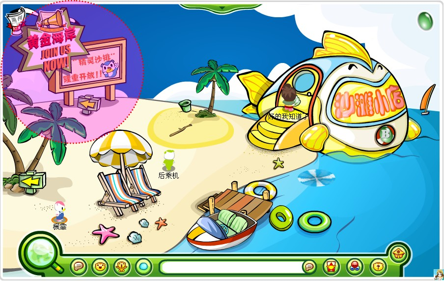 | 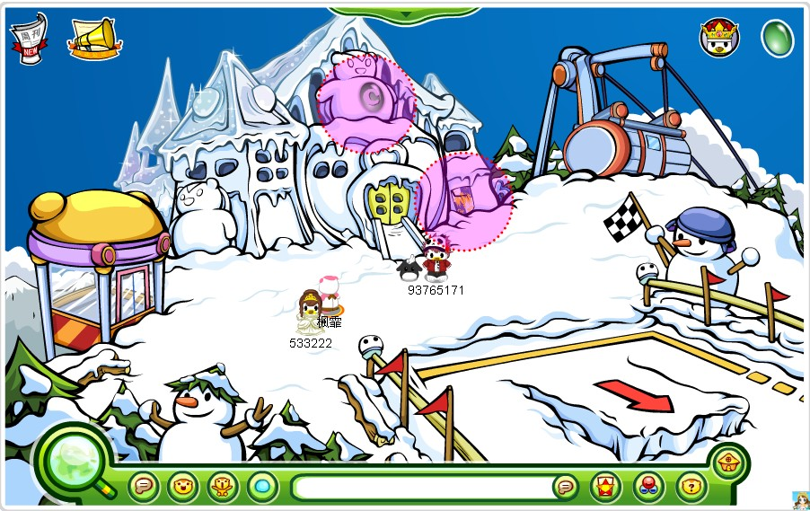 |  |
| --------------------------------------------- | --------------------------------------------- | --------------------------------------------- | --------------------------------------------- |
|  | 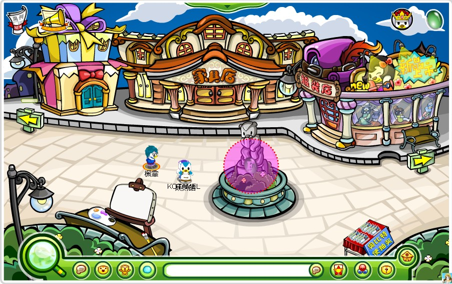 |  | 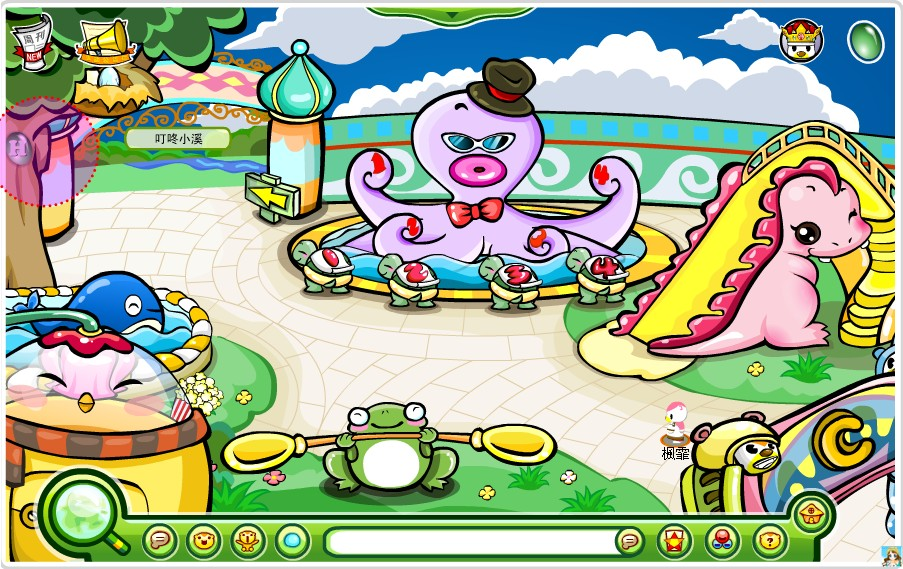 |
| I摩天轮                                          | 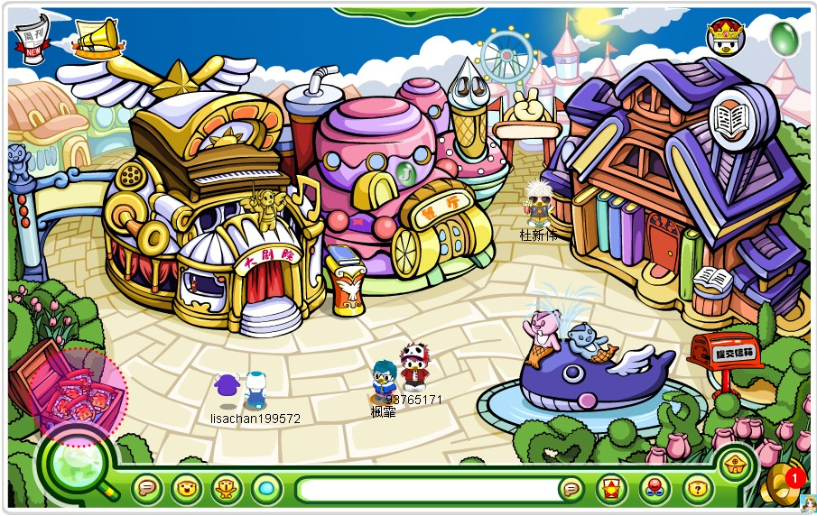 | 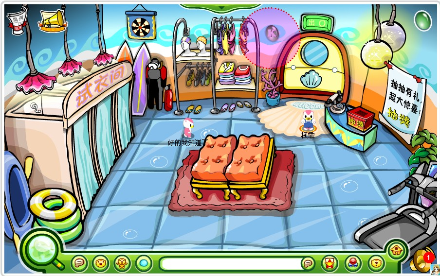 |  |
| M地下室                                          | 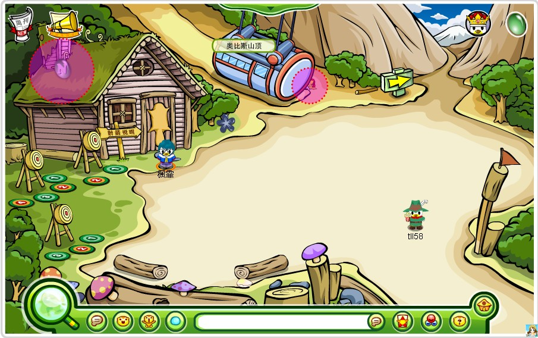 | 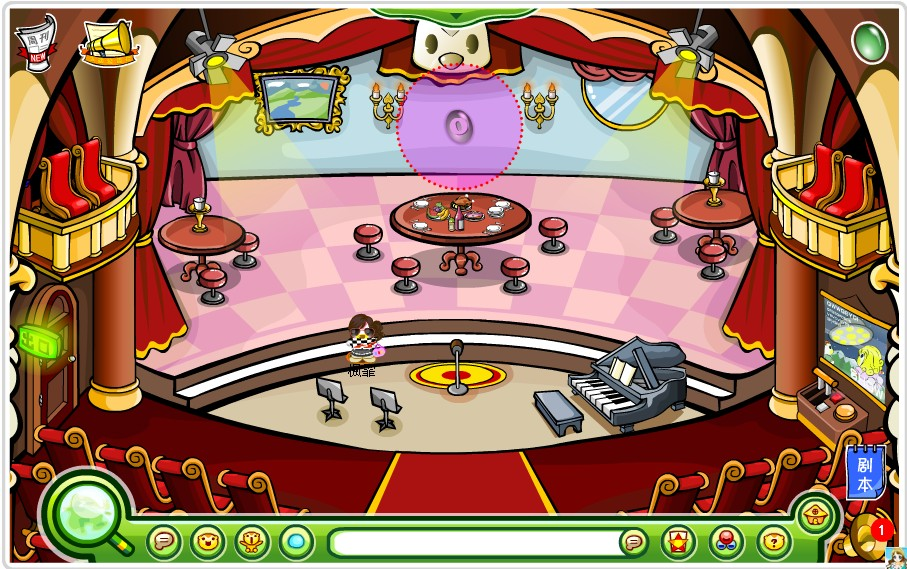 | P餐厅二楼                                         |
| 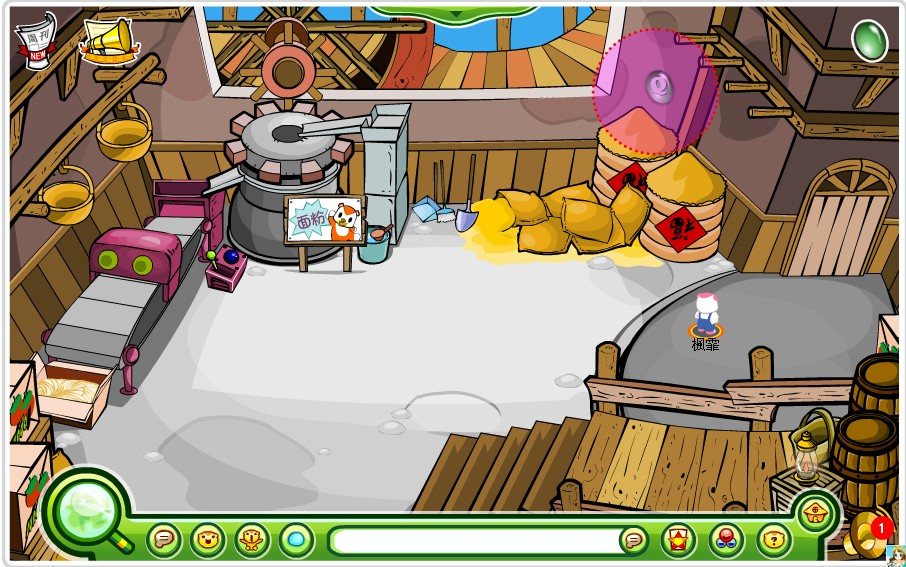 | 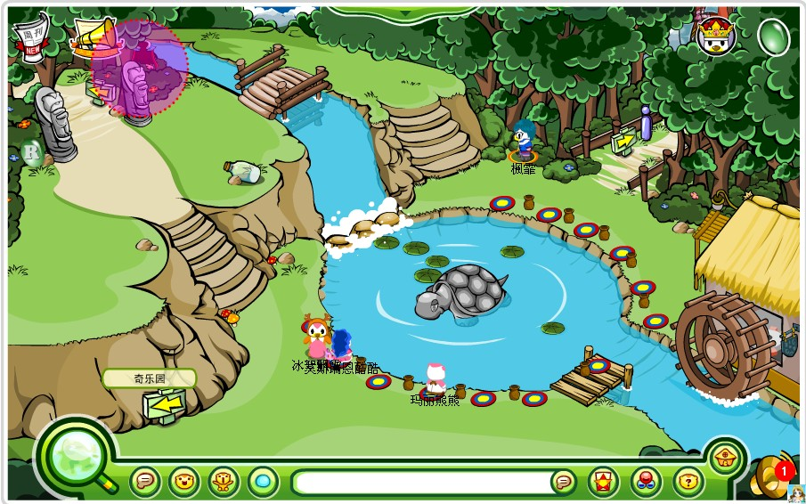 | 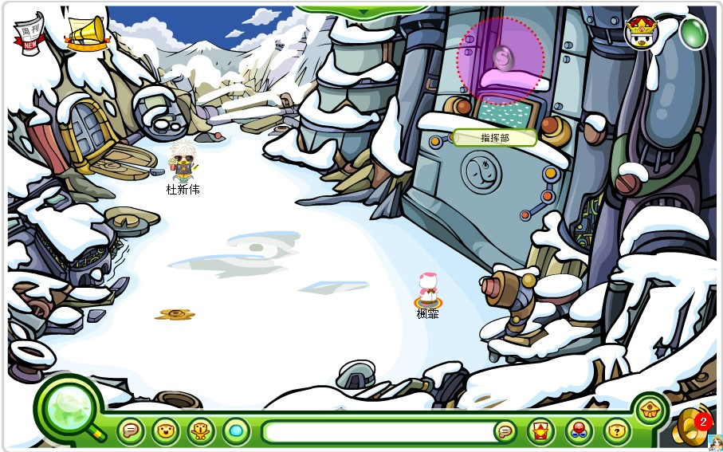 | 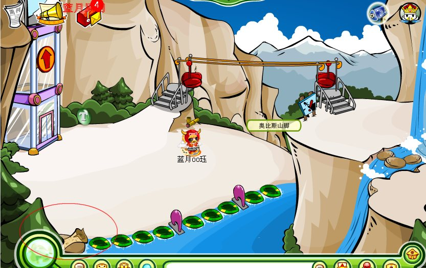 |
| 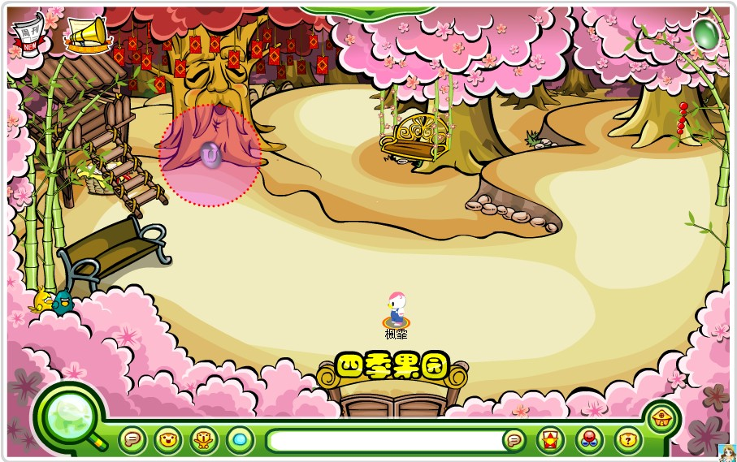 | 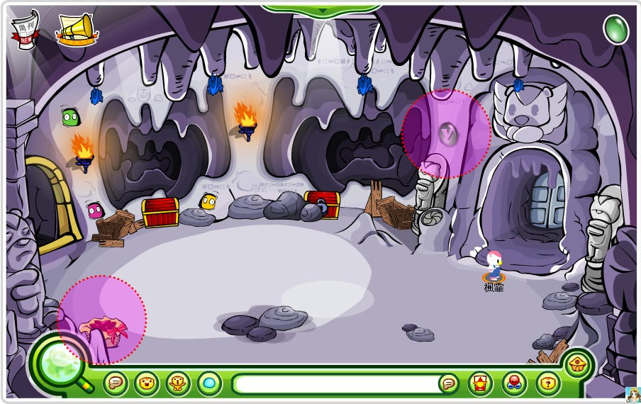 | 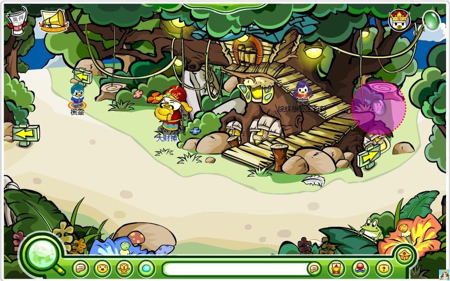 |  |
| 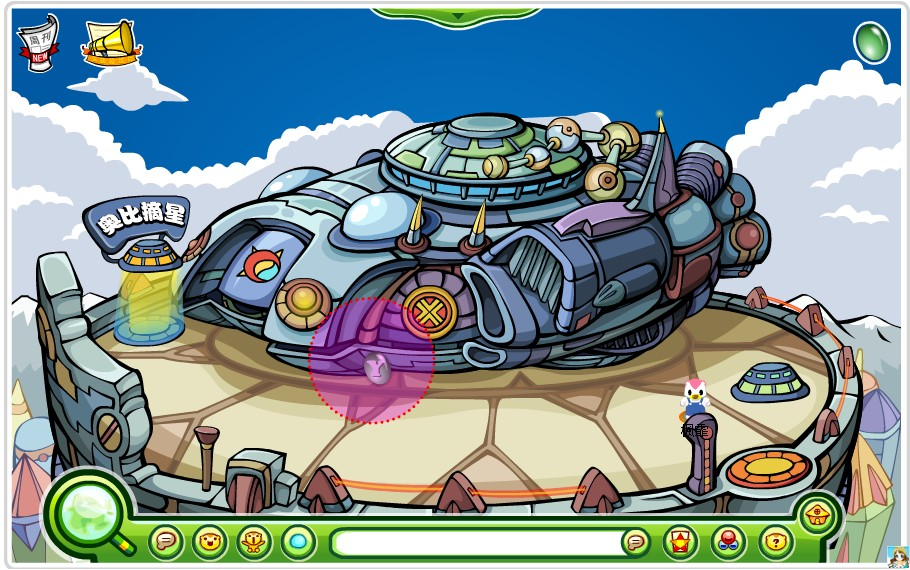 | 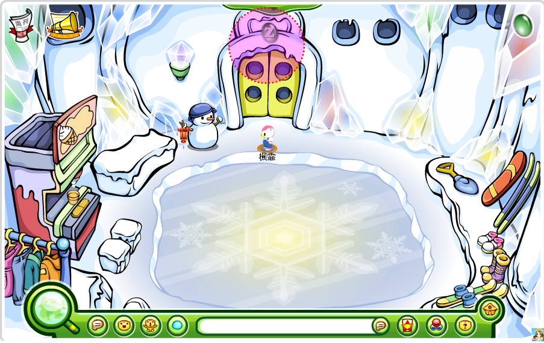 |                                               |                                               |

^
^
^

--: 本页图片来自@奧比楓霏（贴吧）@蓝月oo珏（贴吧）
