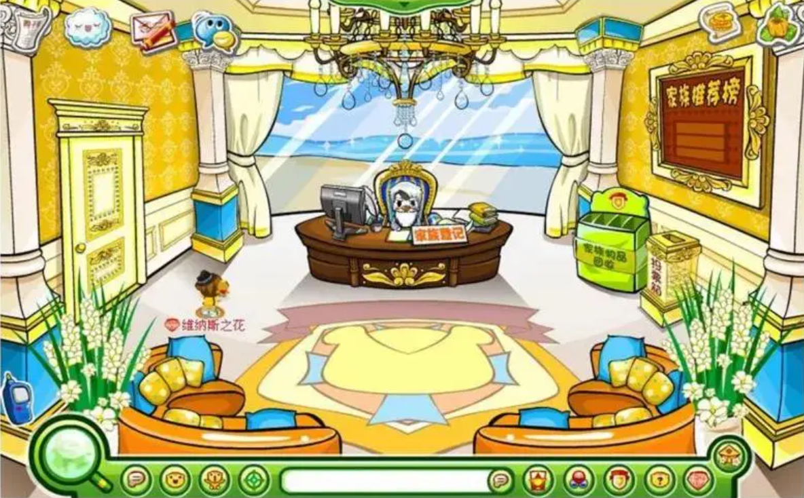
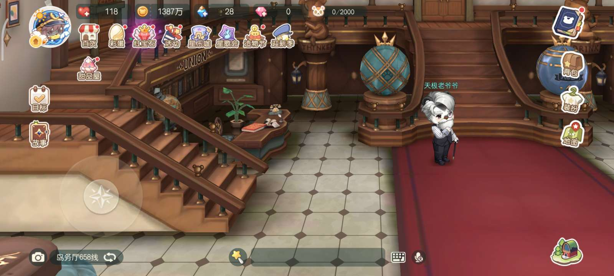
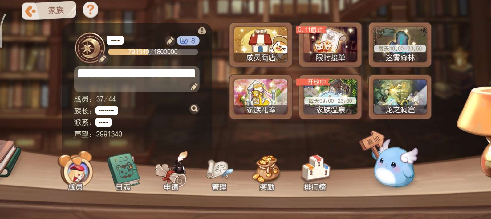
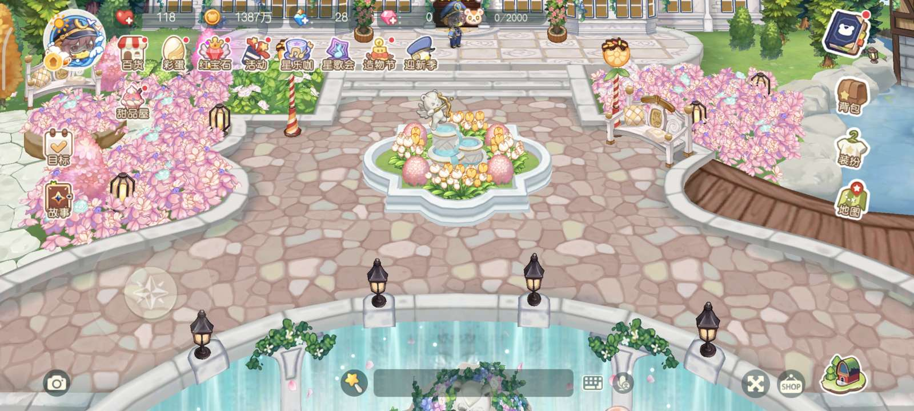

:-: 

^

:-: 

^

在奥比岛上，小奥比们可以创建自己的家族，把自己在奥比岛上的好朋友都聚集到一起，组成一个大家庭。原家族大厅位于阳光大道左上角，现搬至“家族中心”，2013年后家族系统也彻底改版。

* 创建家族的条件？

  1、已经完成5次邀请
  2、在奥比岛生活5天以上
  3、没有登记过奥比家族
  4、你加入的奥比家族不能超过10个

^

* 奥比岛怎么加入家族？

  如果想自己当族长，就去阳光大道去找天极老爷爷申请，不过必须是完成了5次邀请任务的，还有什么条件**天极老爷爷**会告诉你，注意：一个人只能申请一个家族，请楼主慎重慎重，再慎重！！！！\*\*如果想加入别人的家族，在最下面的绿框里面右边有一个家族，点下面的查找家族，输入你想要的家族名称就可以了，不过要经过一定的考验。

^

* 怎么才可以要其他奥比加入我的家族？

  小奥比们新成立了家族可要好好管理呢，每个人只能申请一个家族，当你成立它了，以后都要常常去管理才行呢，开始的时候可能家族成员还比较少，那么就将自己家族的徽章佩戴好，别人点你的徽章就能看到你的家族简介并且加入啦，另外，你还可以记好自己的家族号，让别人找到你的家族直接加入哦！

^

* 奥比岛如何迅速提高家族凝聚力？

  家族凝聚力是一个家族团结的表现。这跟各族员的人数、贡献、交流都有关哦。家族成员经常一起讨论问题、组织活动、经营农场，常为家族做贡献，家族凝聚力就可以得到提升呢。

^

* 奥比岛家族农场凝聚力怎样提高？

  有几种方法，如下：
  1、多点留言
  2、多点人来你的家族
  3、买多点家具，装饰一下
  4、要多点人加入你的家族。

^

* 建设家族的任务流程是什么？

  1、申请家族农场
  2、农场建设1:开垦耕地，建粮仓
  3、装扮农场:获得木桩小凳
  4、装扮农场:获得雷克路灯
  5、农场建设2:引水建瀑布池塘
  6、装扮农场:升级木桩小凳
  7、农场建设3:建设水上广场

^

* 奥比岛的奥比家族在哪里买家族卡？

  奥比家族是不用家族卡的，只要你的岛龄大的话就可以加家族的凝聚力，或者你多为家族做贡献也是可以的！

^

* 奥比岛怎么退家族？

  进入阳光大道，来到家族的管理处，打开家族推荐板，在里面找到你所在的家族之后呢，点击家族的名字，这时候就会弹出“退出家族”的对话框，然后点击退出家族就可以啦\~\~

^
^

--: 页游家族界面为奥比岛早期版本

***

#

# 手游奥比家族

^

奥比岛手游中，家族位于岛务厅，岛务厅位于奥比广场上方。

^

^

寻找**天极老爷爷**完成族长考核，即可在左侧登记注册家族或加入家族。小奥比加入家族后可以参与接单、迷雾森林、家族礼奉、泡温泉、进入龙之洞窟……成员商店中的物资或家具可供族员兑换。

^

每个家族有一个家族基地，成员可以通过粉钻、家族币购买家具，由族长或家族设计师摆放。同时，家族内设有精英、副族长等职务，共同管理奥比家族。

^

^

^
^

--: 本页最后修改时间：20230508
