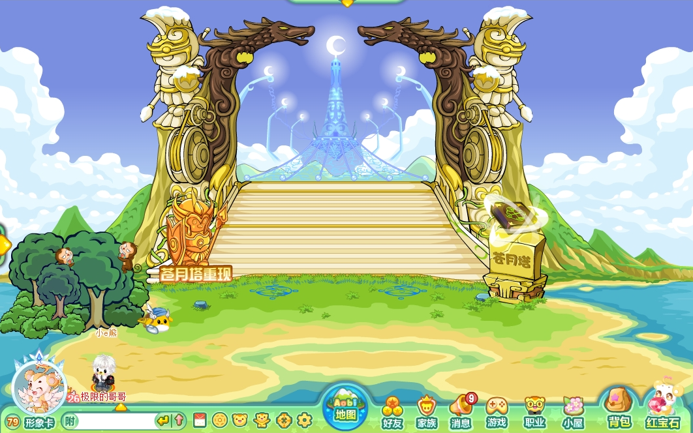
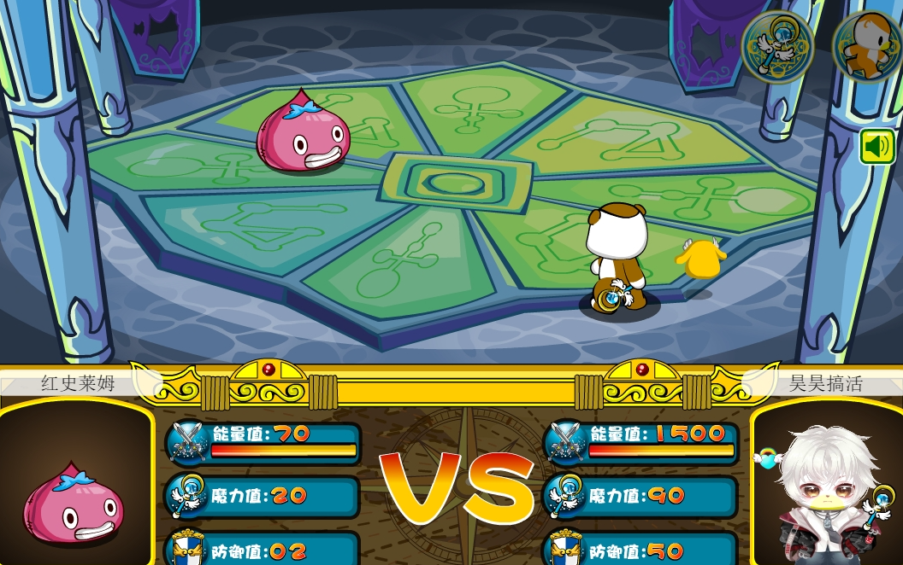
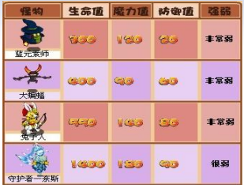
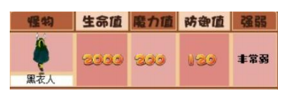
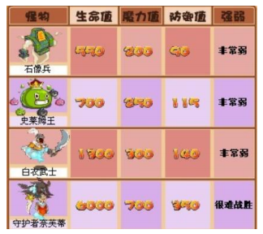
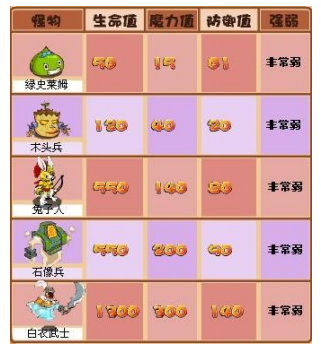
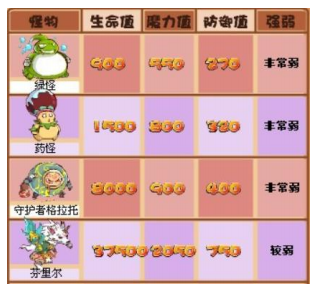
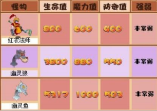
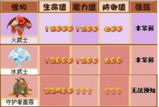
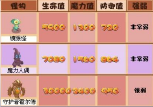

苍月塔是奥比岛于2009年11月13日起开放的首个RPG小游戏，最高开放至第10层，现已关闭。

^

玩家通过战斗收集徽章，累积自身角色的能量值、魔力值、防御值通过层层关卡，还可获得服饰和道具。苍月塔以及遗忘之岛于2012年上半年正式关闭，2018年奥比岛十周年庆期间暂时开放，结束后仍可通过足迹功能到达遗忘之岛，但不可进入苍月塔。2025年4月-7月再次回归。

^

:-: 

^

苍月塔共10层，2-10层都有不同的怪物守卫。

^

:-: 

^

具体守卫者与相关数值如下：

| 第二层 |                                                    |
| --- | ---------------------------------------------------------------------------------------------------- |
| 第三层 |  |
| 第四层 |                                                         |
| 第五层 |                                                         |
| 第六层 |                                                         |
| 第七层 |            |
| 第八层 |            |
| 第九层 |                                                         |
| 第十层 |                                                         |

^
^

--: 本页最后更新时间：20250425
