本页将展示奥比岛的经典小游戏。

^

部分游戏可以通过“[回到老场景](https://9421dwl2gb.k.topthink.com/@aobi/old.html)”方法体验，还可以前往[4399奥比岛小游戏专区](https://so2.4399.com/search/search.php?k=%B0%C2%B1%C8)体验。

 

| 奥比翻牌     |  |
| -------- | --------------------------------------------- |
| **游戏地点** | 云霄乐园--->摩天轮                                   |
| **游戏奖励** | 金币                                            |
| **操作指南** | 用鼠标控制，在规定时间内，翻出所有相同的牌就可以过关！                   |
| **推荐指数** | ☆☆☆                                           |

 

| 奥比分信员    | 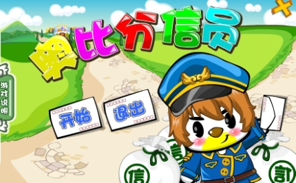                       |
| -------- | ------------------------------------------------------------------- |
| **游戏地点** | 绿荫大道——>奥比邮局                                                         |
| **游戏奖励** | 金币                                                                  |
| **操作指南** | 记住小精灵头上每一封信件的标志，方向 键选择你想要放入信件的邮箱，再按下空格键，投入对应颜色或者标志的信箱，就可以成功的把信寄出去了。 |
| **推荐指数** | ☆☆☆☆                                                                |

 

| 奥比摘星     | 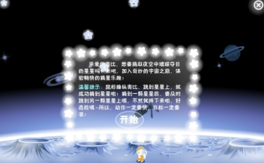              |
| -------- | ---------------------------------------------------------- |
| **游戏地点** | 外星城堡--->星际列车台--->塔台                                        |
| **游戏奖励** | 金币                                                         |
| **操作指南** | 鼠标操纵奥比，跳到星星上，就可以成功摘到星星了，摘到一颗星星后，要及时跳到另一颗星星上，动作一定要快，目标一定要准！ |
| **推荐指数** | ☆☆☆☆                                                       |

 

| 包装汤圆     | 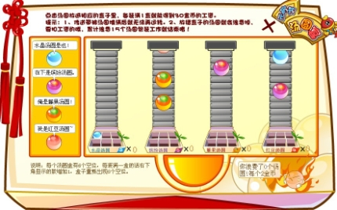 |
| -------- | --------------------------------------------- |
| **游戏地点** | 奥比广场--->餐厅二楼                                  |
| **游戏奖励** | 金币                                            |
| **操作指南** | 点击汤圆放进相应的盒子里，每装满一盒就能得到30金币的工资。                |
| **推荐指数** | ☆☆☆☆                                          |

 

| 捕鱼       | 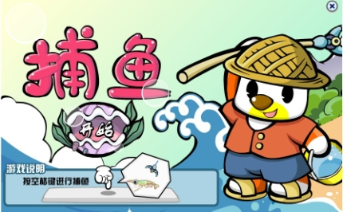 |
| -------- | --------------------------------------------- |
| **游戏地点** | 叮咚小溪                                          |
| **游戏奖励** | 金币                                            |
| **操作指南** | 用空格键操作，用鱼钩捕捉鱼就可以获得对应的金币了。                     |
| **推荐指数** | ☆☆☆☆☆                                         |

 

| 反击第一战    | 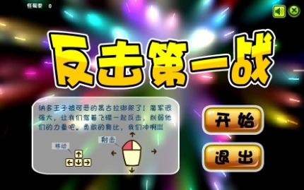 |
| -------- | --------------------------------------------- |
| **游戏地点** | 蔚蓝海岸——>远征军纪念馆一楼                               |
| **游戏奖励** | 金币                                            |
| **操作指南** | 用鼠标发射子弹控制方向，键盘的方向键控制整个射击的位置，看到攻击目标消灭掉即可。      |
| **推荐指数** | ☆☆☆                                           |

 

| 仿真演习     |  |
| -------- | --------------------------------------------- |
| **游戏地点** | 奥比斯山脚                                         |
| **游戏奖励** | 金币                                            |
| **操作指南** | 用对应的攻击方式把小妖怪打败，按相应的数字键或者用鼠标点击相应的攻击按钮，空格键跳跃。   |
| **推荐指数** | ☆☆☆☆                                          |

 

| 花样滑雪     | 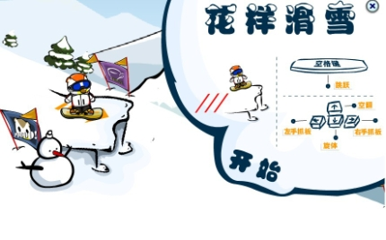 |
| -------- | --------------------------------------------- |
| **游戏地点** | 奥比斯山顶                                         |
| **游戏奖励** | 金币                                            |
| **操作指南** | 按方向键控制方向、旋体、空翻，空格键跳跃。                         |
| **推荐指数** | ☆☆☆☆☆                                         |

 

| 见习小医生    | 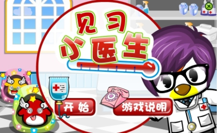   |
| -------- | ----------------------------------------------- |
| **游戏地点** | 阳光大道                                            |
| **游戏奖励** | 金币                                              |
| **操作指南** | 用鼠标将生病的小精灵放到医生的垫子上，诊出病因后把精灵送到治病区，点击药物 对小精灵进行治疗。 |
| **推荐指数** | ☆☆☆☆☆                                           |

 

| 金笛的娃娃    | 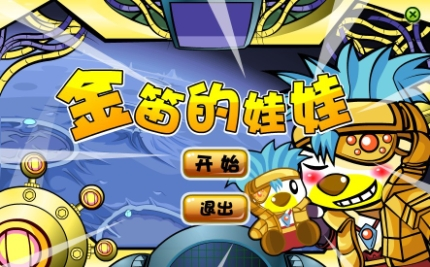 |
| -------- | --------------------------------------------- |
| **游戏地点** | 蔚蓝海岸—远征军纪念馆二楼                                 |
| **游戏奖励** | 金币                                            |
| **操作指南** | 左右移动鼠标，控制机械手左右移动，点击鼠标左键向下夹娃娃。                 |
| **推荐指数** | ☆☆☆                                           |

 

| 精灵找花     |  |
| -------- | --------------------------------------------- |
| **游戏地点** | 精灵岛精灵学堂                                       |
| **游戏奖励** | 金币、花茶                                         |
| **操作指南** | 按方向键控制精灵找花，但是要避开花虫。                           |
| **推荐指数** | ☆☆☆☆                                          |

 

| 开心餐厅     | 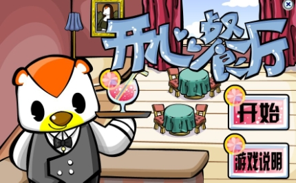                            |
| -------- | ------------------------------------------------------------------------ |
| **游戏地点** | 奥比广场--->餐厅一层                                                             |
| **游戏奖励** | 金币                                                                       |
| **操作指南** | 餐厅服务生，从招待客人，直到客人用餐 完毕，如下图示：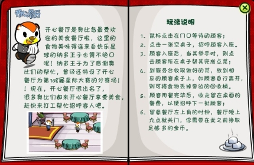 |
| **推荐指数** | ☆☆☆☆☆                                                                    |

 

| 木阳的故事    | 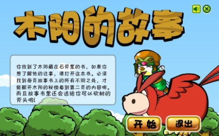 |
| -------- | --------------------------------------------- |
| **游戏地点** | 蔚蓝海岸--->远征军纪念馆二层                              |
| **游戏奖励** | 斧头                                            |
| **操作指南** | 找到每页书上的不同之处，大家来找茬                             |
| **推荐指数** | ☆☆☆                                           |

 

| 水果连连看    | 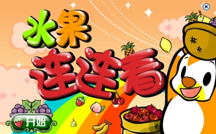 |
| -------- | --------------------------------------------- |
| **游戏地点** | 哈根农庄--->农庄小屋                                  |
| **游戏奖励** | 金币                                            |
| **操作指南** | 点击一样的水果，它们将会互相抵消，在 规定时间内完成就可以过关了。             |
| **推荐指数** | ☆☆☆☆☆                                         |

 

| 睡梦枕头     | 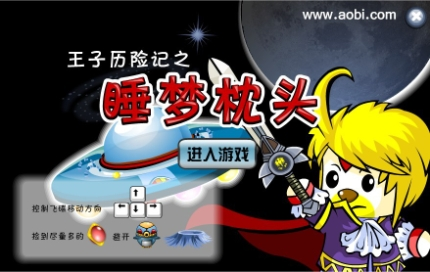 |
| -------- | --------------------------------------------- |
| **游戏地点** | 蔚蓝海岸--->远征军纪念馆一层                              |
| **游戏奖励** | 金币                                            |
| **操作指南** | 控制飞碟的移动 方向，捡到尽量多的红宝石。                         |
| **推荐指数** | ☆☆☆☆                                          |

 

| 跳棋       | 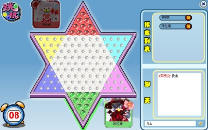 |
| -------- | --------------------------------------------- |
| **游戏地点** | 奥比广场---> 图书馆一层                                |
| **游戏奖励** | 金币                                            |
| **操作指南** | 需两人或三人参加，玩法与日常的跳棋一样                           |
| **推荐指数** | ☆☆☆                                           |

 

| 五子棋      | 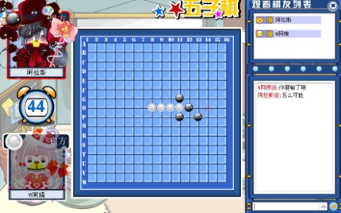 |
| -------- | --------------------------------------------- |
| **游戏地点** | 奥比广场---> 图书馆一层、二层                             |
| **游戏奖励** | 金币                                            |
| **操作指南** | 需两人参加，玩法与日常的五子棋一样                             |
| **推荐指数** | ☆☆☆                                           |

 

| 小鱼汤米的梦想  | 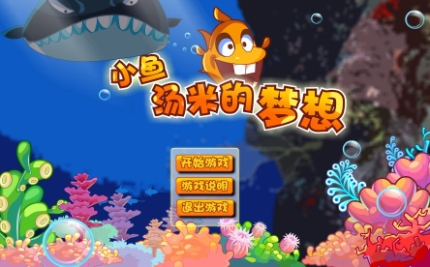                        |
| -------- | -------------------------------------------------------------------- |
| **游戏地点** | 假日海滩                                                                 |
| **游戏奖励** | 金币，终极奖励：水晶鲸鱼雕像一个                                                     |
| **操作指南** | 移动鼠标控制小 鱼汤米移动，吃掉比汤米小的鱼，躲避比汤米大的鱼，吃掉小鱼可以获得成长值，成长值达到一定量，小鱼汤米会变大，吃掉更大的鱼。 |
| **推荐指数** | ☆☆☆☆                                                                 |

^

| 章鱼的颜色诱惑  | 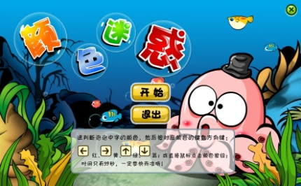 |
| -------- | --------------------------------------------- |
| **游戏地点** | 精灵岛                                           |
| **游戏奖励** | 金币                                            |
| **操作指南** | 判断泡泡中字的颜色，按下对应颜色方 向键或者直接点击颜色。                 |
| **推荐指数** | ☆☆☆                                           |

 

| 拯救小水妖    | 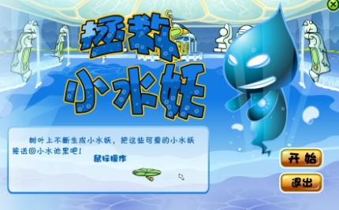 |
| -------- | --------------------------------------------- |
| **游戏地点** | 蔚蓝海岸--->远征军纪念馆二层                              |
| **游戏奖励** | 金币                                            |
| **操作指南** | 移动荷叶，将小水妖安全地接到右边的水池中。                         |
| **推荐指数** | ☆☆☆                                           |

 

| 捉迷藏的羊    | 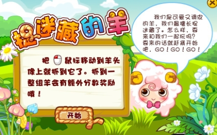 |
| -------- | --------------------------------------------- |
| **游戏地点** | 交易广场---->红宝石会所                                |
| **游戏奖励** | 金币                                            |
| **操作指南** | 用鼠标移至小羊的头像，代表小羊被抓了 。将每个关卡中抓到规定数目的小羊，就能得到奖励了。  |
| **推荐指数** | ☆☆☆                                           |

 

| 天才蛋糕师    | 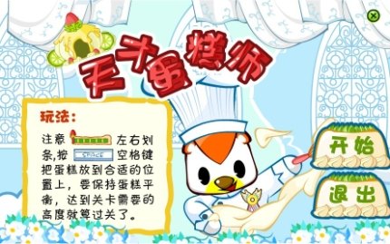 |
| -------- | --------------------------------------------- |
| **游戏地点** | 奥比广场--->餐厅二层                                  |
| **游戏奖励** | 金币、各种蛋糕师徽章                                    |
| **操作指南** | 按空格键将蛋糕放到合适的位置，要保持蛋糕店的平衡，达到关卡需要的高度就可以过关。      |
| **推荐指数** | ☆☆☆☆                                          |

***

| 魔法寿司快快吃   | 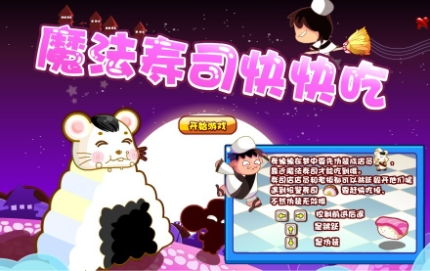                                                                                                                                                |
| --------- | -------------------------------------------------------------------------------------------------------------------------------------------------------------------------------------------- |
| **游戏地点**  | 奥比广场--->餐厅一层                                                                                                                                                                                 |
| **游戏奖励**  | 金币                                                                                                                                                                                           |
| **操作指南**  | 用键盘上的方向键，来控制寿绵绵。←  →两个按键用于控制寿绵绵向前走和向后走。↑ 按键是用来让寿绵绵向上跳的，比如遇到凳子、桌子、滚动的木桶，就要使用这个 按键来通过了。↓ 按键是用来让寿绵绵伪装的，当快要遇到寿司的时候，就要按住↓的按键，直到在寿司的面前了，才放开，就能吃到寿司了。另 外要注意的是：寿司店的老板，可能会来追你，这时候就不要管神马寿司了，直接往前先跑了再说。 |
| **推荐指 数** | ☆☆☆☆☆                                                                                                                                                                                        |

 

| 漂流       | 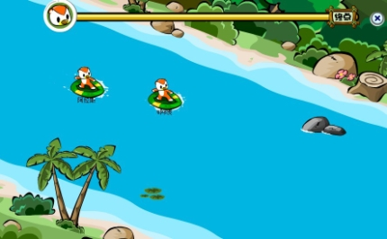     |
| -------- | ------------------------------------------------- |
| **游戏地点** | 奥比斯峡谷                                             |
| **游戏奖励** | 金币                                                |
| **操作指南** | 属于多人游戏，按左右移动，空格跳跃，遇到河马和荷叶要避开，遇到那块大石，就滑上去，遇到小石要避开。 |
| **推荐指数** | ☆☆☆☆                                              |

 

| 精灵育幼院    | 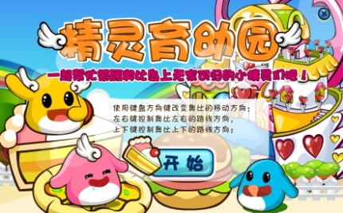            |
| -------- | -------------------------------------------------------- |
| **游戏地点** | 阳光海滩--->慈善之家                                             |
| **游戏奖励** | 金币                                                       |
| **操作指南** | 使用键盘方向键改变奥比的移动方向，利 用上下左右键操纵食物的走向，送给有相应需求的精灵，每成功送达一只奖励8金币 |
| **推荐指数** | ☆☆☆☆                                                     |

 

| 天才蛋糕师    | 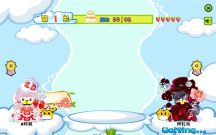 |
| -------- | --------------------------------------------- |
| **游戏地点** | 奥比广场--->餐厅二层                                  |
| **游戏奖励** | 金币                                            |
| **操作指南** | 和天才蛋糕师差不多，区别就在于是两个 人一起玩的，你扔一层我扔一层。            |
| **推荐指数** | ☆☆☆☆                                          |

 

| 穿越锁妖塔    | 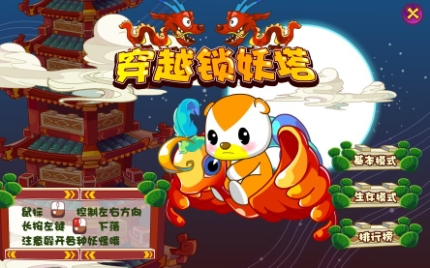                                            |
| -------- | ---------------------------------------------------------------------------------------- |
| **游戏地点** | 灵山寺                                                                                      |
| **游戏奖励** | 金币                                                                                       |
| **操作指南** | 鼠标左右移动，可以控制奥比的左右方向，按住鼠标左键，可以控制奥比下降，飞到塔顶就算胜利。注意：奥比不能加速上升，遇到危险或者妖怪，可以使用下降来 躲开。每人每次都有5次的生命。 |
| **推荐指数** | ☆☆☆☆☆                                                                                    |

 

 

^

--: 本页最后更新时间：20230516
