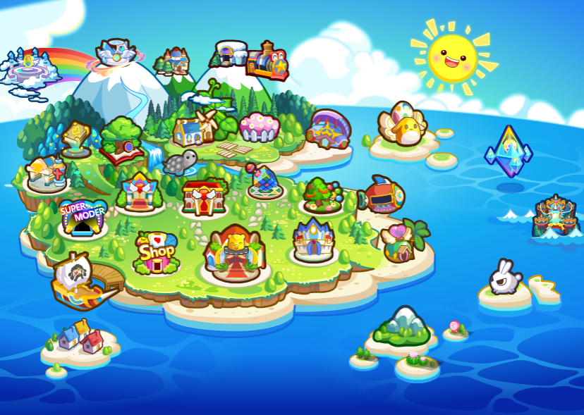

（\**奥比岛新手指南篇主要指页游*）

^

```[bilibili]
https://www.bilibili.com/video/BV1GT4y1G7Ww
```

几万年前世界冰川溶化，奥比的祖先们乘坐巨大的飞船跨越海洋，来到一座充斥着各种猛兽和怪物的孤岛上，非常危险。奥比们不畏艰难，凭借努力，最终在红宝石岛民的带领下，**将孤岛建设成为现在的奥比岛**……

^


^

岛上有瑰丽奇伟的自然风光，有繁华热闹的都市风景，有梦幻可爱的各式小屋，有趣味十足的比赛，有精彩奇妙的活动，有新奇丰富的工作。还有古老神秘的传说，神秘莫测，引人遐想。

^



^

奥比岛不仅是儿童享受乐趣的虚拟社区，也是儿童学习和成长的快乐园地。奥比岛的目标是让儿童参与各种充满童趣和想象力的活动的同时，不断提高各种能力，促进儿童身心健康发展，营造健康、积极的社区文化。

^
^

奥比岛页游网址：<http://www.100bt.com/aobi/>

因主流浏览器**不再支持flash组件**，需要下载flash插件或使用[Flash中心](https://game.flash.cn/)软件打开。另外，还可以下载[百田游戏安全管家](https://guanjia.100bt.com/)软件打开网址。

^
^
^

--: 视频贡献：@囧囧style（小红书）

--: 本页最后修改时间：20230508
