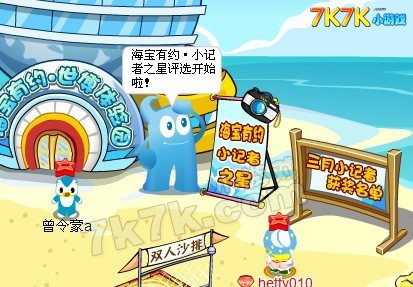

海宝有约是奥比岛与上海世博会在2010年1月推出的联名活动，玩家化身“小记者”共同宣传推广世博会知识。

^

:-: 

^

同年，《海宝有约――奥比岛超级明星档案》系列图书由外语教学与研究出版社及著名儿童网络动漫社区“奥比岛”联合推出，图书用人物秀、宝物展、游戏相册、个性空间等丰富的栏目，全方位展示最受小朋友欢迎的奥比岛明星的历险故事和世博的历史知识。

^

:-: 

^

图书附赠“小记者报名卡”邀请小读者报名成为小记者，参与世博、报道世博，并有机会到上海免费参观世博。

^
^

--: 本页最后更新时间：20230807
