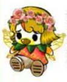

| NPC                                                                                                                                  | 名字       | 身份                       | 地点          | 手游是否出现  |
| ------------------------------------------------------------------------------------------------------------------------------------ | -------- | ------------------------ | ----------- | ------- |
|                                                                                    | W阿姨      | 《奥比周刊》主编                 | 奥比广场-图书馆一楼  | 是       |
|                                                                                         | 大胡子叔叔    | 领航员负责人                   | 领航员大厅       | 是       |
|                                                                                    | 小耶       | 服装店老板                    | 淘宝街-服装店     | 是       |
|                                                                                    | 潘潘       | 家具店老板                    | 淘宝街-家具店     | 是       |
|                                                                                         | 阿拉斯      | 青木魔法学院校长                 | 青木森林-青木魔法学院 | 是       |
|                                                                                    | 叮当       | 红宝石协会会长                  | 红宝石广场       |         |
|                                                                                    | 铃当       | 奥比岛首席记者                  | 奥比广场        | 是       |
|                                                                                     | 凤娃       | 精灵之家负责人                  | 精灵岛-精灵之家    | 是       |
|                                                                                     | 龙娃       | 船长                       | 神龙号船舱       | 是       |
|  | 黑古拉/黑元素师 | 奥比岛反派，宇宙强盗，时间线重置后身份改变    | 无处不在        | 是       |
|                                                                                     | 水颜公主     | 美食星继承人                   | 美食星         | 是       |
|                                                                     | 黑莲公主     | 水颜公主守护花之一，黑古拉手下，后与纳多王子结婚 | 快乐星球        | 是       |
|                                                                                     | 纳多王子     | 快乐星球王子，祖父是星际大赛的开创者       | 快乐星球        | 是       |
|                                                                                    | 夜西       | 商人                       | 交易广场        | 是       |
|                                                                                         | 风儿       | 百花园管理者                   | 百花园         | 是       |
|                                                                                     | 天极老爷爷    | 家族负责人                    | 家族大厅        | 是       |
|                                                                     | 火凤       | 魔法老师                     | 青木魔法学院      | 是       |
|                                                                                     | 华大夫      | 医生                       | 医院          | 是       |
|                                                                                     | 鹦鹉教授     | 英语老师                     | 精灵学堂        | 是       |
|                                                                    | 年兽       | 一个小反派                    | 蔚蓝海岸        | 是       |
|                                                                                    | 雷欧       | 远征军司令                    | 远征军据点       | 是       |
|                                                                                     | 秦天       | 大导演                      | 大剧院         |         |
|                                                                                         | 巴巴特      | 奥比邮局局长，如卡小博士设计的机器人       | 邮局          |         |
|                                                                                     | 哈皮       | 魔术师                      | 蔚蓝海岸        | 是       |
|                                                                                    | 莎莎       | 人鱼，与星诺是CP                | 码头          |         |
|                                                                                     | 星诺       | 人鱼                       | 码头          |         |
|                                                                         | 玄霜       | 法师                       | 灵山寺         | 是       |
|                                           | 罗米·欧     | 模特，小耶大学同学，小精灵是小米         | 摩登秀场        |         |
| .png> =101)                                                             | 道尔       | 侦探，与夏玲是CP                | 森林公园        | 以服装形式出现 |
|                                                                    | 夏铃       | 怪盗                       | 森林公园        |         |
|                                                                                                                                      |          |                          |             |         |
|                                                                                                                                      |          |                          |             |         |
|                                                                                                                                      |          |                          |             |         |

^
^
^

--: 本页最后修改时间：20231001
