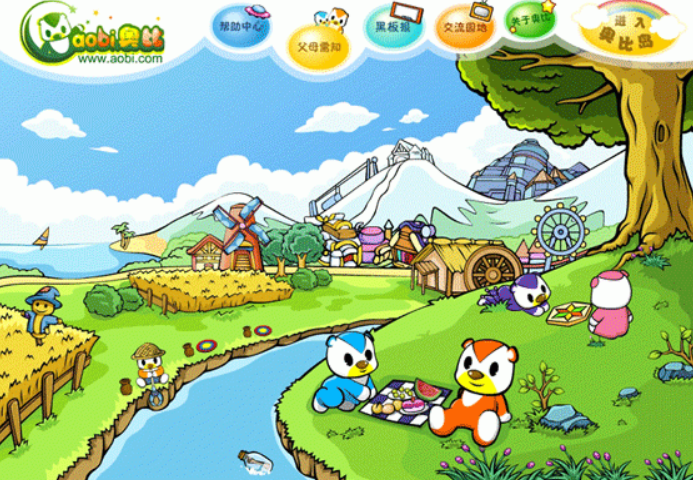
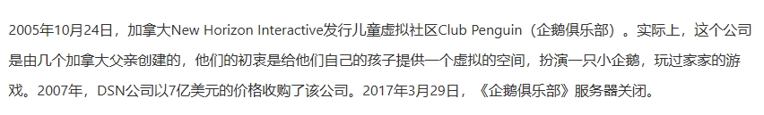
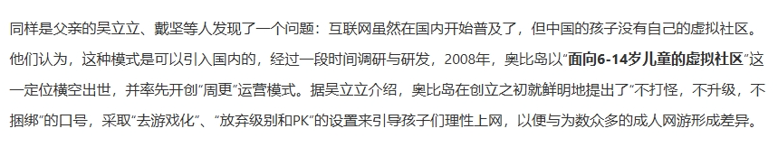
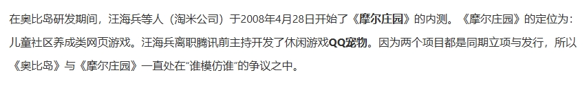
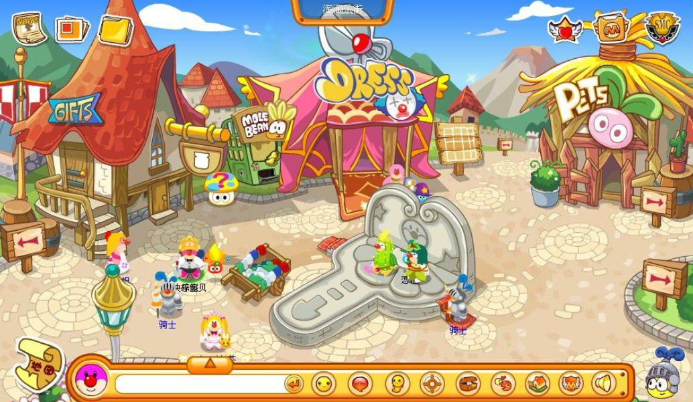
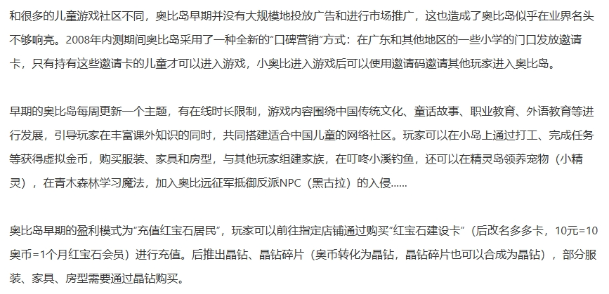

:-: 

《奥比岛》是由广东阿尔创通信技术有限公司（后奥比岛项目组成立**广州百田**公司）研发的一款以交友、模拟经营为主的**儿童（Z世代）互联网社区**，并于2008年9月25日正式发行。口号是：**爱上奥比岛，快乐没烦恼**！

^

2009年奥比岛获“中国妇女儿童喜爱品牌”，“广州市优秀动漫企业”。2010年获“第三届中华优秀出版物奖-优秀出版物提名奖”，“2010年度最佳儿童社区游戏”，“2010年度最受用户喜欢网站”。2011年奥比岛入选第六批“民族网络游戏出版工程”。

^

:-: 

^

截止2022年，页游累计注册用户超3亿，最高月活跃用户超1100万。

^

***

^

奥比岛是一个海上的小岛，玩家是居住在岛上的小熊，小熊的名字叫奥比。在后来的官方解释中，小熊的祖先对应现实世界中的北极熊。

^

^

:-: 

^

^

:-: 

^

^

:-: 

^

^

^

2013年-2014年期间，因**Z世代（1995-2005年出生**） 客观条件限制，奥比岛开始进入过渡期。2014年6月，奥比岛推出**人形**（魔力形态），玩家可以切换人形或奥比形态，但官方主线剧情以人形为主，引发奥比岛第一次“退游潮”。自此，奥比岛主线剧情不再是周更，游戏模式以“换装”为主，游戏地图也进行了巨大更新，百奥（百田母公司）将奥比岛确定为 “**女性向”网页游戏** 。

^
^

2017年3月，奥比岛主线剧情时间线重置。主线剧情为单元故事，主要玩法为换装。

^

2022年7月《奥比岛：梦想国度》公测。

^
^
^
^
^

--: 本页最后修改时间：20250403
