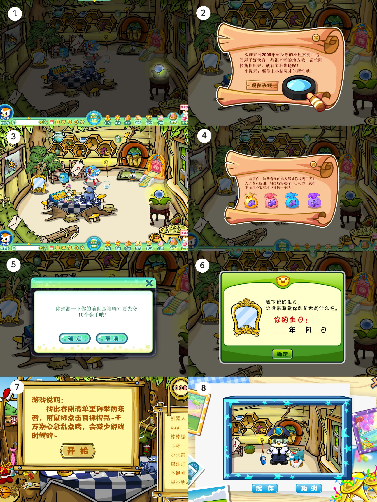
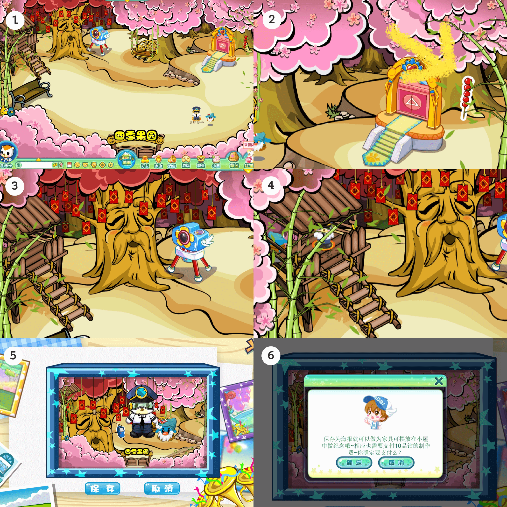
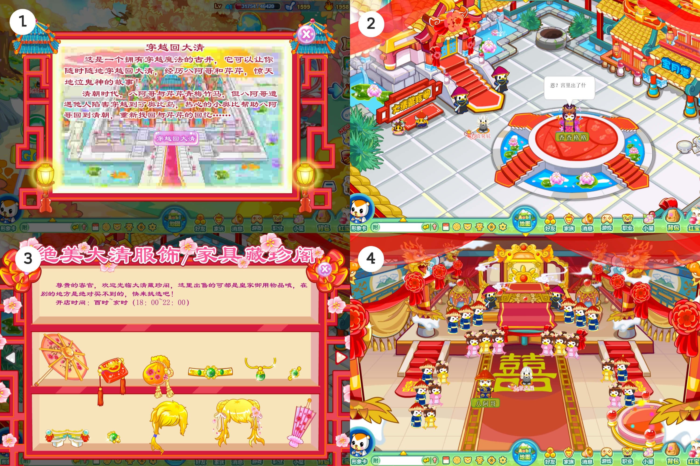
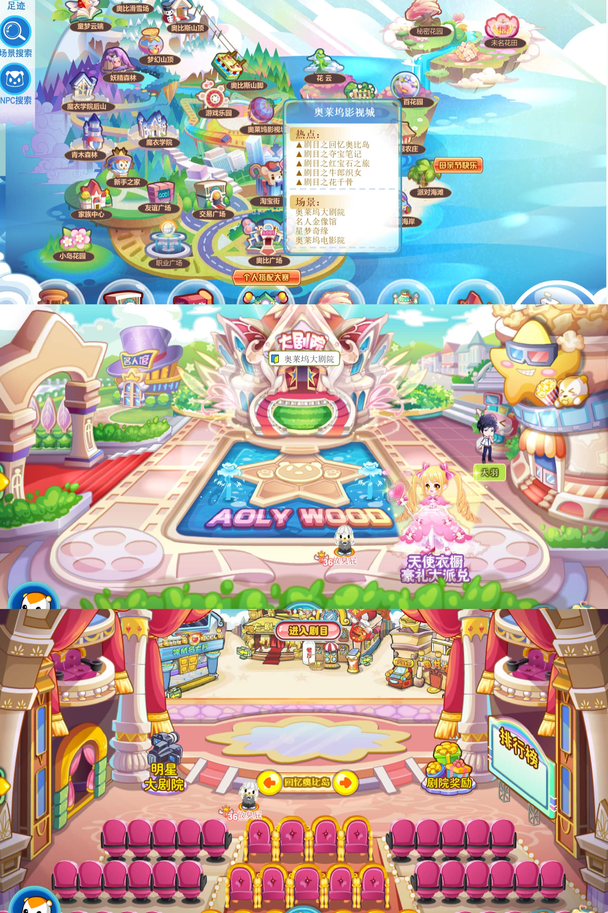
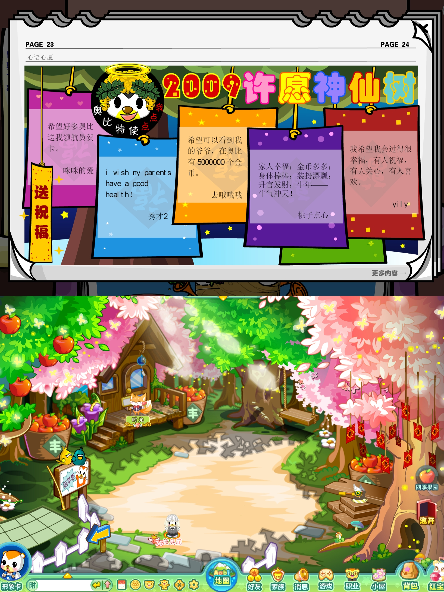
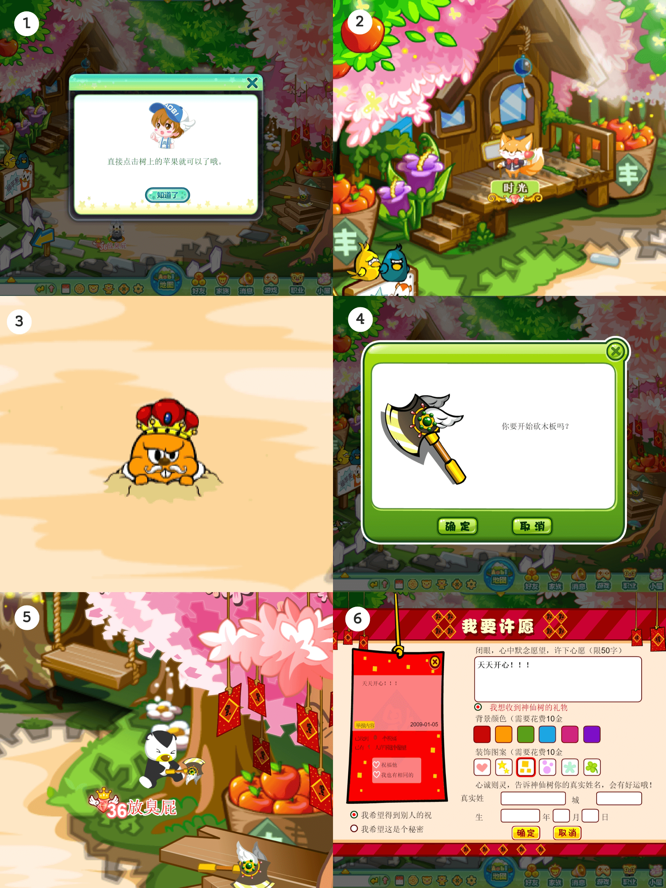
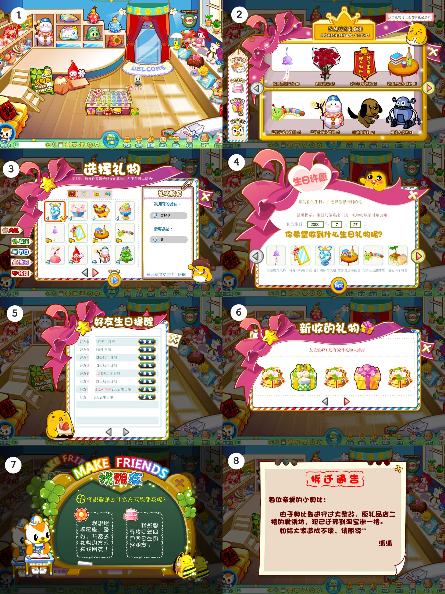
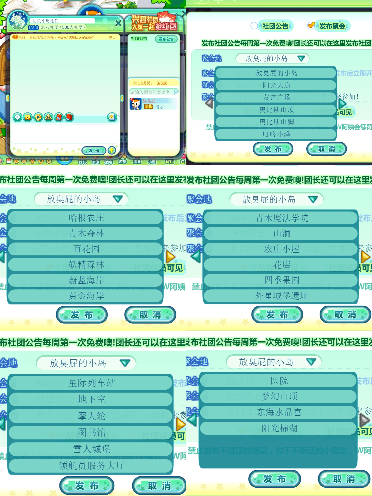

因历史原因，奥比岛90%老场景均无法再直接进入。但官方仍然保留了一些入口，小奥比们可以通过以下方式进入一些老场景打卡。

^

> [info] 图片较多，请耐心等待加载

^

## 一、小屋家具

### （1）传送门

:-: 

| 目标场景        | 密码     | 玩法介绍                                                                                 | 截图                                                          |
| ----------- | ------ | ------------------------------------------------------------------------------------ | ----------------------------------------------------------- |
| 09年春节的奥比广场  | 090126 | 制作吉祥铜钱 \| 合照                                                                         |  |
| 09年阿拉斯的小屋   | 090520 | ①电亮魔法球照亮场景；②带小精灵一起找到奇怪的地方；③场景样貌；④找完五处奇怪的地方获得宝石袋；⑤花费10金币测前世；⑥填写生日；⑦找找看小游戏；⑧拍照留念       |             |
| 09年圣诞节的淘宝街  | 091225 | ①点击图中星星按钮电亮场景灯光；②场景展示；③点击小铁锹；④按照提示花费20金币挖礼物；⑤会挖出不同的小精灵物品；⑥拍照留念                       |  |
| 09年万圣节的四级果园 | 091101 | ①场景展示；②糖葫芦（现在已经不可以获得啦）；③鼠标放在树爷爷上，树爷爷会笑；④小阁楼可以进去；⑤拍照留念；⑥传送门的所有拍照功能如果选择保存为小屋家具需要花费10晶钻 |  |

^

### （2）小屋家具——大清穿越古井

* 购买方式：家具店
* 价格：1000金币

:-: 

* 玩法：

①点击古井，穿越回大清

②场景：皇宫外

③点击2左中的大清藏珍阁

④场景：皇宫内

^

:-: 

^

## 二、通过剧目回到奥比岛

进入方法：  地图-奥莱坞影视城-奥莱坞大剧院-选择“回忆奥比岛剧目”-点击“进入剧目

^

:-: 

^

### 场景展示：

（1）叮咚小溪

* ①和NPCw阿姨对话
* ②漂流瓶许愿
* ③捕鱼（新版钓鱼，**旧版钓鱼可以前往4399搜索“奥比岛钓鱼**”）

^

（2）青木森林

* ①和NPC夜西对话
* ②黑市商人（出现地点随机）买卖（不建议购买！真的很黑！
* ③接红包小游戏

^

（3）齐乐园

* ①鲸鱼喷泉（鼠标放在这里就会有动画）
* ②小鸡爆米花（鼠标放在这里就会有动画）
* ③青蛙跷跷板（小奥比坐在两边，跷跷板会倾斜）
* ④恐龙滑滑梯（小奥比从楼梯上去，点滑梯会有动画）
* ⑤章鱼动脚（需点击标有数字的小乌龟，对应的章鱼脚会动）

^

（4）奥比广场

* ①领航员大厅上方屏幕动画
* ②点击餐厅可进入开心餐厅游戏
* ③ATM机
* ④鼠标放至右下角远征军会有动画
* ⑤点击

^

## 三、通过奥比周刊回到老场景

（1）周刊15期23-24页，点击左方黄底红字“送祝福”，进入场景四季果园

^

^

场景玩法：

①摘苹果

②点击NPC时光，进入水果变变变游戏

③打鼹鼠

④砍木板

⑥点击树爷爷许愿

^

^

点击场景下方进入场景：哈根农庄

场景玩法：

①点击鸡旁边的篮子获得鸡蛋×1

②NPC稻草人

③哈根农庄耕田打工

（此地图水井可互动但不能获得水）

^

^
^

（2）周刊72期第二页右上角-锦绣商业中心

场景里有ATM机

^

^

点击餐厅进入场景：餐厅

玩法：

①小神厨烹饪区

②神厨仓库

^

^

点击右边宝石大厦进入场景：宝石大厦

玩法：

①场景展示

②场景NPC：土狼

③与NPC对话：如何成为小神厨

④打工地点：宝石大厦咨询处招募管理员（红宝石打工600金币）

⑤星级评定点（**此玩法已被关闭**）

⑥开店申请 | 每日出租店面 | 抽取店号（**此玩法均已关闭**）

^

^
^

（3）通过周刊139期进入场景——假日海滩

进入方法：周刊139期-第一页点击右下方假日海滩GO-抵达场景“假日海滩”

场景玩法：

①慈善之家纪念牌

②游戏：小鱼汤米的梦想

^

^
^

## 四、通过奥比时尚月刊进入场景——礼品店

进入方法：

①淘宝街-服装店-右下方服装店图册

②点击图册《奥比时尚2》

③奥比时尚7月刊

④点击第6页右方粉底白字“更多礼品”

^

^

场景玩法：

①场景展示

②礼物柜

③送礼物

④生日许愿

⑤好友生日提醒

⑥新收的礼物

⑦找朋友

⑧拆迁通告

^

^
^

## 五、通过发布聚会回到老场景（部分进入方法被删除）

^

^

## 六、通过魔力图鉴进入

（1）115届星际大赛主赛场（此界面只可进入，且会卡住）

进入方法：

①鼠标放至界面最左上角奥比杂志-点击魔力时装

②在界面下方输入“墨蓝”-点击搜索-点击右下方“马上就去”

③进入“星际大赛主赛场”

^

^
^

## 七、通过社团发布聚会进入

进入方法：社团-发布公告-发布聚会

可进入地点如下：

^

^
^
^
^
^

--: @快乐小奥比（小红书）对本页有重要贡献

--: 本页最后修改时间：20230516
