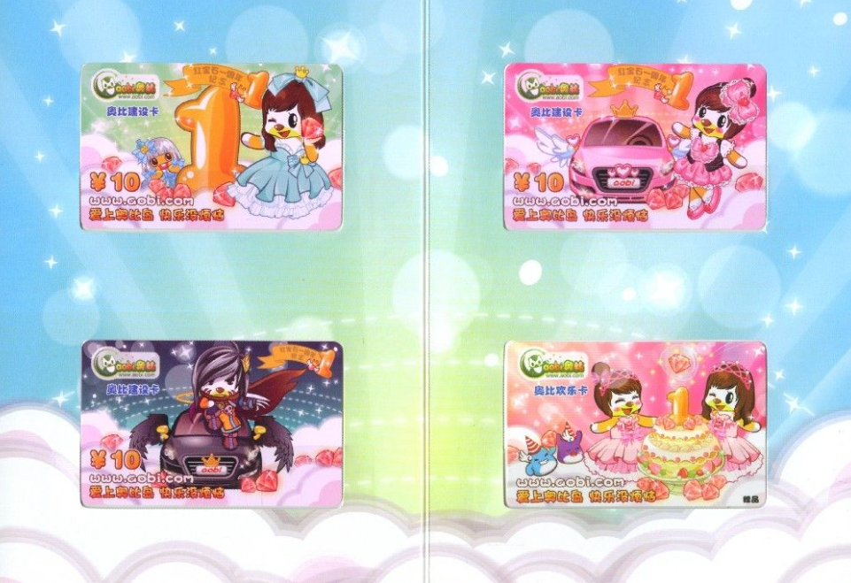
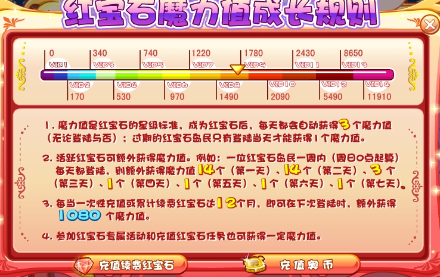
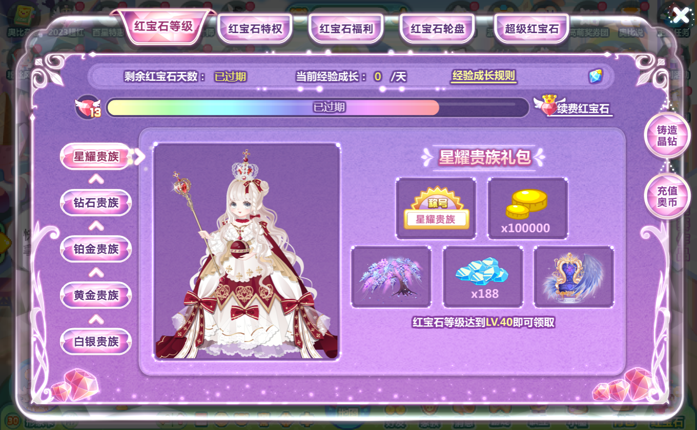

:-: 

^

在奥比岛上，**红宝石岛民**（也叫红宝石居民）代表“游戏会员”，后期页游中还推出了“**超级红宝石**”。手游中称为“**红宝石会员**”。红宝石标志由“王冠”“翅膀”和“红宝石”构成（早期只有一个红色宝石）。

^

2009年8月28日，奥比岛正式实行会员收费制，在全国各大网点开售“奥比建设卡”（后改名多多卡），此时奥比岛注册用户突破4000万。一张多多卡售价10RMB，10奥币=10RMB。据媒体报道，奥比岛是中国第一个推行儿童游戏会员收费制的游戏。后期除多多卡外，还支持网银、神州行充值卡、电话（15RMB）。现在还支持支付宝、微信支付、QQ钱包等。

^

^

红宝石岛民作为建设奥比岛的主要成员，他们不怕辛苦，不怕困难，以建设奥比岛，使奥比岛更加繁荣昌盛为己任，一心为更多的小奥比提供良好的居住环境，让小奥比们获得更幸福更快乐的生活！

^

### 1、精选大礼包

每周、每月都有超值礼包等你来拿。每周更是超过15个小礼包任你挑选，红宝石星级越高，可选择的数量越多哦！

:-: 

:-: 

###

### 2、交易特权

在交易广场，红宝石岛民除了可以把不需要的东西卖给夜西，还可以自由和其他红宝石岛民交易，得到你想要的物品。

:-: 

^

### 3、专属坐骑

红宝石会所为红宝石岛民提供专属的坐骑，让你与众不同，成为众人的焦点。

:-: 

^

### 4、星级好礼

红宝石岛民随着魔力值的成长，每达到一个红宝石星级，都可以开启星级大礼包，无数精品等你来拿哦！

:-: 

^

### 5、超低折扣

红宝石岛民在淘宝街购物，还可以享受专属折扣，让你轻松购买，绝不手软！

:-: 

^

### 6、以旧换新

每月的第四个星期六和星期天和会员日举办“以旧换新”的活动日，红宝石岛民可以在红宝石会所中用自己的旧衣服换取当月奥币新品服饰，紧跟潮流脚步！

:-: 

^

### 7、购物优惠

即将开放红宝石专属的“折扣卡”，可以使用超低折扣购买奥币物品，为你精打细算！

:-: 

^

### 8、自由摆摊

红宝石岛民可以进入专属场景“神秘世界”（位于蔚蓝海岸），批发神秘世界独家出品的服饰，自由定价、摆摊卖给所有的小奥比！

:-: 

^

### 9、专属豪车

红宝石岛民可以在星级大礼包中免费获得专属豪车，开着它在奥比岛兜风，不仅可以提高移动速度，还能吸引众人眼光哦！

:-: 

^

### 10、昵称随心

红宝石岛民拥有专属的昵称，可以随心所欲的修改你的名字，还有更多丰富昵称框让你选择，全部免费使用哦！

:-: 

^

### 11、专属场景

红宝石岛民拥有自己的专属场景，为红宝石岛民提供温暖宽敞、独具特色的红宝石之家，给你最优质的服务和体验。

:-: 

^

### 12、进入满员岛

红宝石岛民为了更快建设奥比岛，满员的蘑菇岛优先提供给红宝石岛民进去哦！

:-: 

^

### 13、绝版竞拍

每月的第一周，红宝石会所都会举办绝版竞拍活动，全部0底价，让你轻松获得更多绝版商品！

:-: 

^

### 14、专属任务

每个星期，红宝石会长会为红宝石岛民派发一个红宝石专属的秘密任务，完成秘密任务可以获得宝石券兑换专属宝石首饰哦！

:-: 

^

### 15、专属舞会

红宝石会所每个月的第二个星期五都会为红宝石岛民举办主题舞会，让红宝石岛民可以在舞会上结交更多好友、拿礼物，度过快乐的周末！

:-: 

^

### 16、更多空间

红宝石岛民可以使用自己的红宝石魔力，为你的个人形象卡服装栏和小屋仓库增加容量，而且还能升级你的衣柜，让你存放更多的服饰哦！

^

红宝石岛民自推出起，**LV12为满级**。2013年升级为LV14。2015年升级为LV25。目前，奥比岛会员体系更改为：星耀、钻石、铂金、黄金、白银。每个阶段对应10LV，星耀为满级。

^

:-: 

^

:-: 

^

:-: 

^
^

--: 界面和内容均为奥比岛早期版本

--: 本页最后修改时间：20230508
