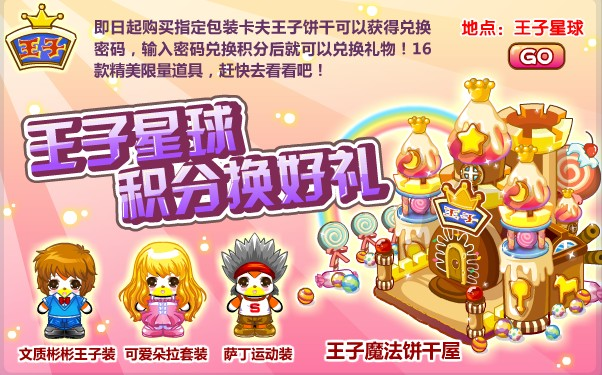
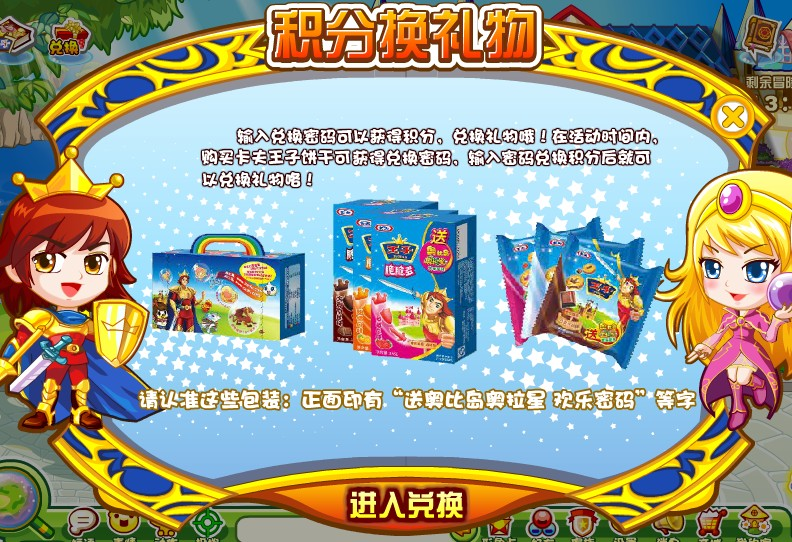

王子星球是奥比岛与卡夫王子饼干于2010年4月推出的联名活动，后多次复刻。

^

玩家可以进入星际列车站前往“王子星球站”，帮助卡尔夫王子三人完成任务，获得时装、家具、收集物等奖励。

^

:-: 

^

::link[奥比岛王子星球案例摘得2011戛纳广告节铜狮大奖]{url="http://games.sina.com.cn/w/n/2011-06-29/1506509999.shtml"}

^

据媒体报道，**该模式开创了国内IGA合作的先例**。项目上线期间有超过两千万儿童参与“王子星球”品牌互动体验，线上游戏参与次数9.93亿次。

^

玩家可以线下购买“王子饼干”获得兑换密码，兑换三套服装与一套家具。

^

|  |  |
| --------------------------------------------- | --------------------------------------------- |

^
^

--: 本页最后修改时间：20230807
