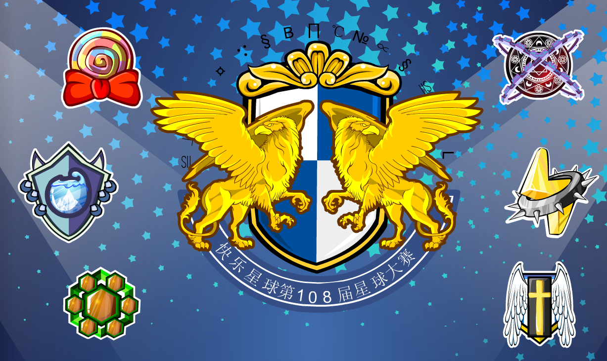
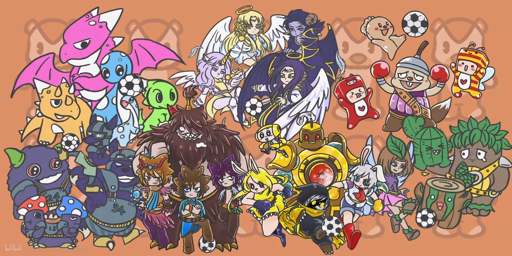

星际大赛是奥比岛每年7-8月举办的一项传统活动。游戏设定第一届星际大赛由纳多王子的祖父举办，从108届（2009年）开始小奥比可以报名星际大赛。

^

早期的参赛队伍固定，有天使联盟队、异空间队、金属潮流队、冰封湖队、彩虹棒棒糖队、绿野仙踪队。后又以该年最热ip作为参赛队伍，现在以玩家为队长（或玩家参与投票选出的ip）作为参赛队伍。

^

:-: 

^

经典的比赛项目有百步穿杨、快乐足球、开心餐厅、沙弧球、极限攀岩、粉丝助威团、变异动物快快跑等。

^

--: 图源B站@史懒基

^

--: 本页最后更新时间：20230807
