小精灵 是奥比岛上的首个“宠物”或“玩家伙伴”，奥比岛早期所有游戏玩法、职业玩法基本都是围绕小精灵展开。每位小奥比都可以拥有至少一个精灵蛋，孵化后可以变成小精灵。

^

| 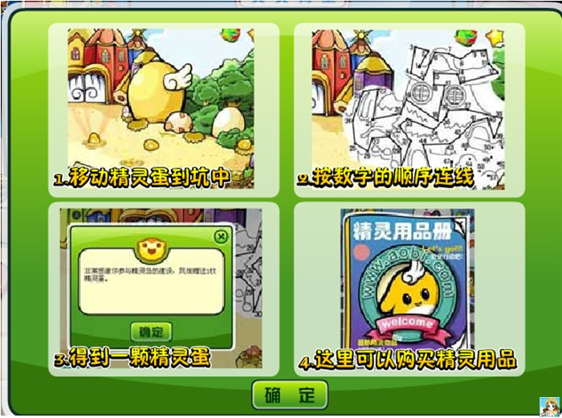 | 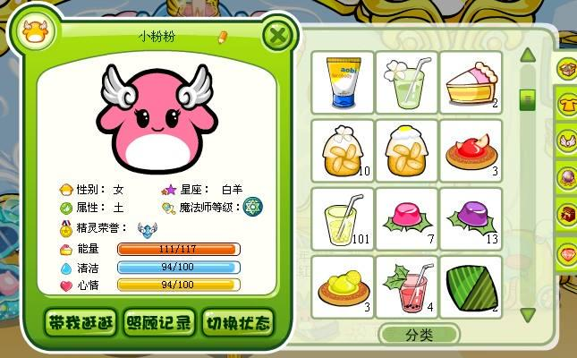 |
| --------------------------------------------- | --------------------------------------------- |

^

2008年年兽到访奥比岛，小精灵诞生，此后一直留在奥比岛。2014年后小精灵不再是奥比岛的核心玩法。

^

小奥比同样可在精灵岛上的精灵之家购买精灵蛋，每位玩家最多可养三只小精灵，颜色可在橙、黄、绿、紫、蓝、红、粉、黑8种颜色中挑选（**现在可养第四只白色小精灵**）每只小精灵都有自己独有的星座、属性、性别。早期玩家购买精灵蛋需要在小屋孵化三天，每天1分钟（后期变为一天十秒）。

^

小精灵有三种形态，分别是无翅膀、单翅膀、双翅膀（后来出了第四种魔法形态）。形态成长和小精灵年龄有关（第四形态除外），小精灵可以学习各种技能，小精灵的能力、清洁、心情需用**精灵食品**照顾，如果没有照顾好小精灵会生病，需要职业医生看病，也会离家出走（死亡），此时需去慈善之家将它找回（现在需要前往**精灵房**重新孵化），小精灵也有自己的服装和互动家具，一些早期房型会提供精灵房（如：白雪公主城堡）。

^

## 精灵之家

精灵岛和精灵之家由所有小奥比共同建造， 任务有通过数字连线画出精灵之家的外形、抵御台风等等。精灵岛有三个子场景：精灵之家、精灵学堂、地下洞穴。

^

| 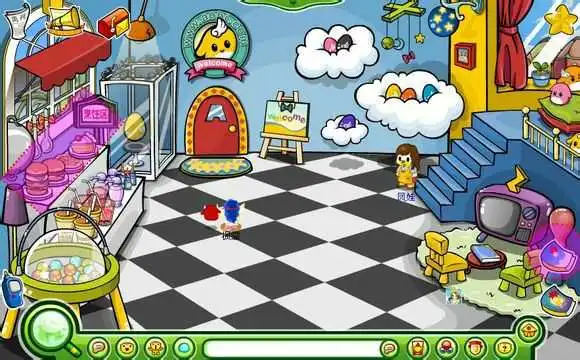 | 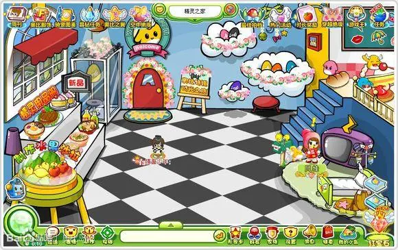 |
| --------------------------------------------- | --------------------------------------------- |

| 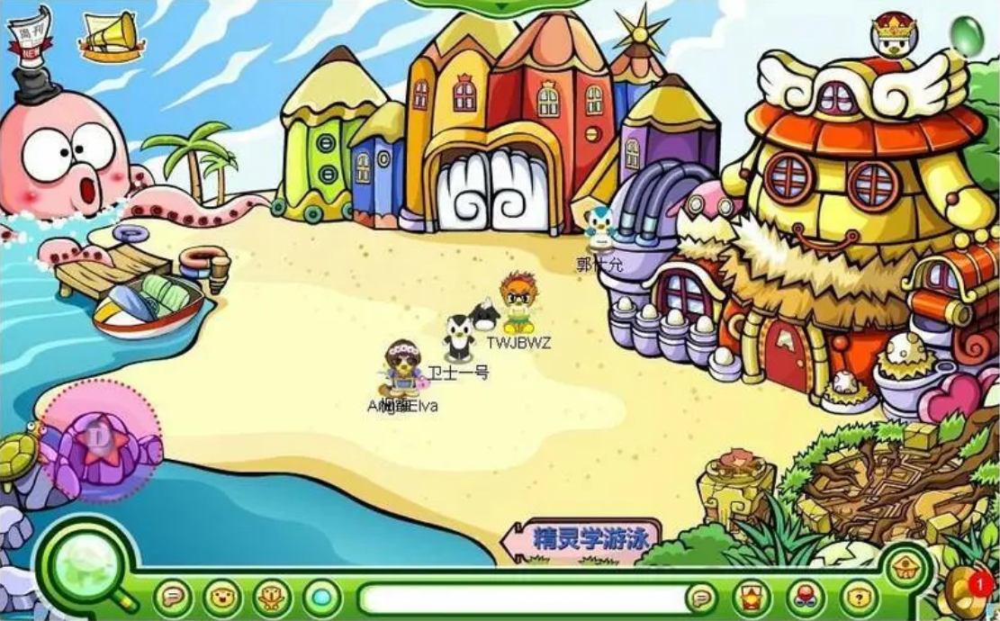 |  |
| --------------------------------------------- | --------------------------------------------- |
| 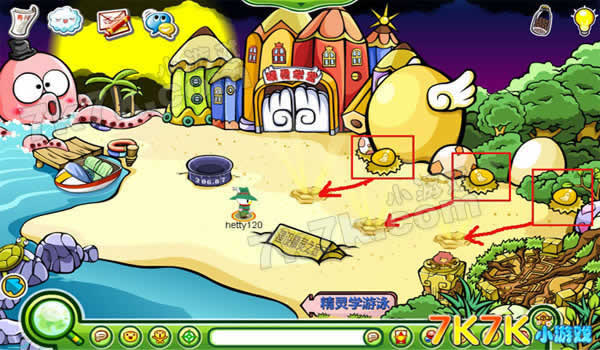 | 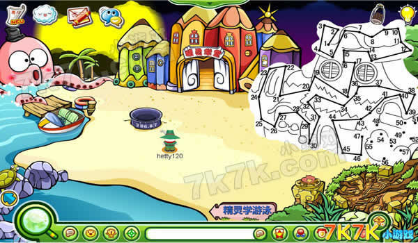 |

^

现精灵岛已经从地图中取消，现在可以在地图中搜索“小精灵家园”，进入“精灵房”。

^

:-: 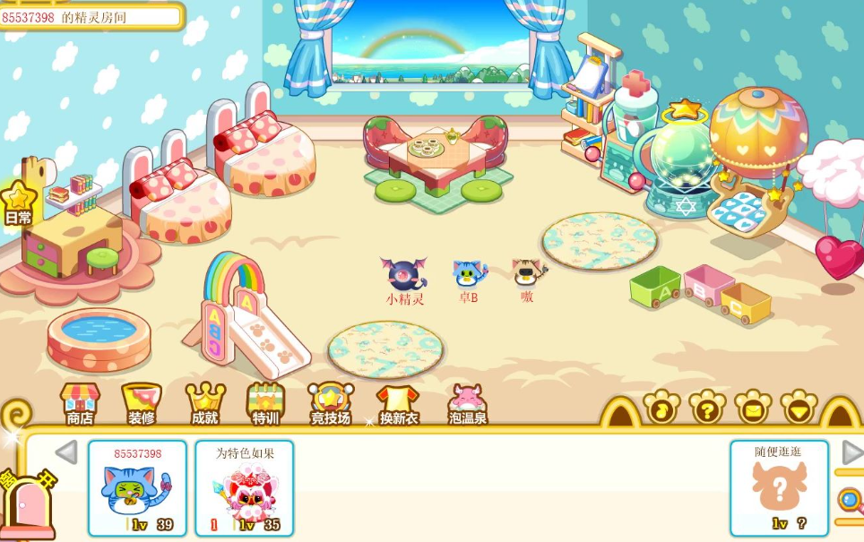

^

## 学习技能

小精灵长大后可学习游泳、说话、英语。

* 学会游泳可获得游泳证书在精灵栏可见
* 学会说话可让小精灵自主说话
* 学会英语可让小精灵时不时飙英语

| 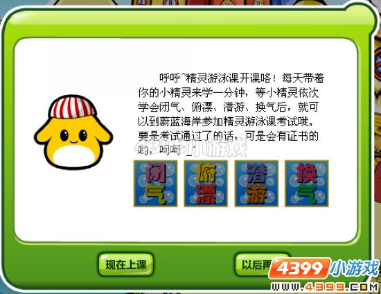 | 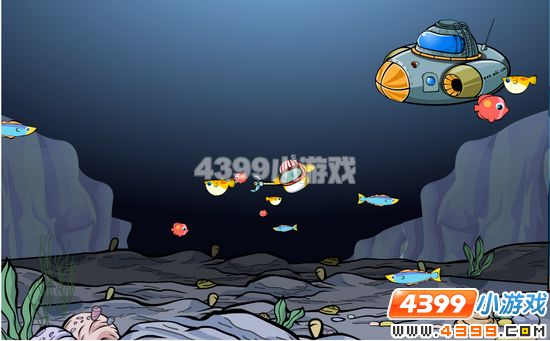 |
| --------------------------------------------- | --------------------------------------------- |
| 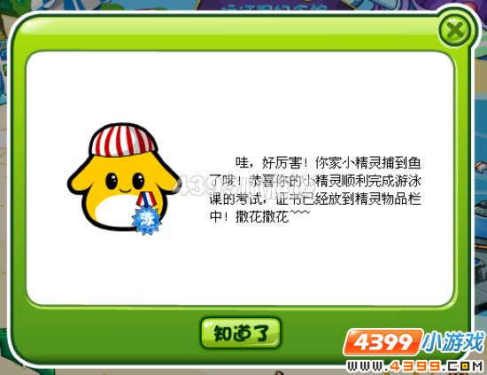 | 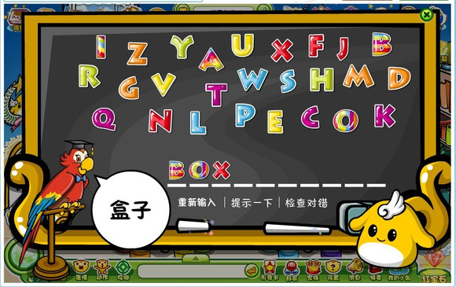 |

^

## 学习魔法

小精灵魔法可在青木森林中的青木魔法学院学习，魔法分为战斗魔法、变身魔法、功能魔法。变身魔法有时长限制，战斗魔法无。玩家如果想使用魔法就要穿上服装“**蓝宝珠魔棒**”。

^

|  | 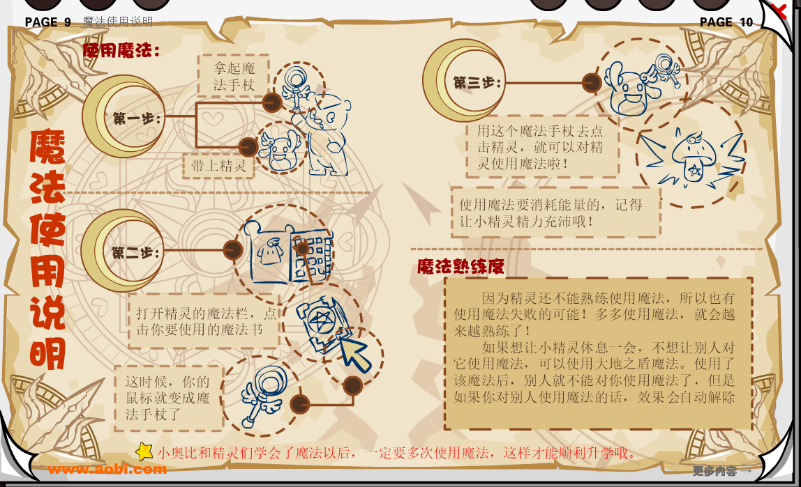 |
| --------------------------------------------- | --------------------------------------------- |
| 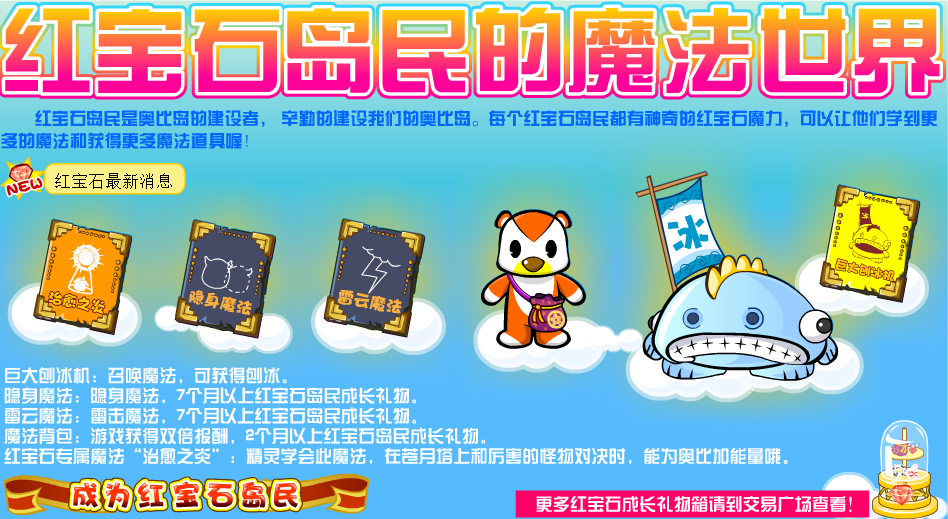 | 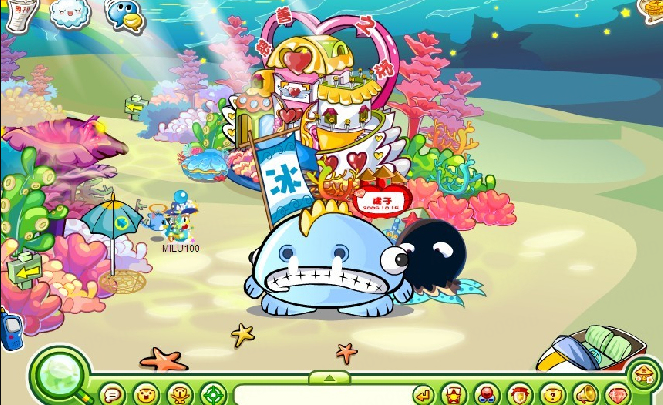 |

^

* 战斗魔法可在苍月塔和修炼场中使用，无法在日常场景使用。
* 变身魔法可在任何地点使用，可对其它人/自己使用。

^

此时小精灵出了魔法形态，以前的衣服无法穿上。奥比也随之修改（开始拟人）。第四形态随着魔法玩法取消，后期也一同取消。

^

| 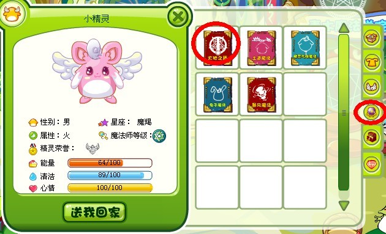 | 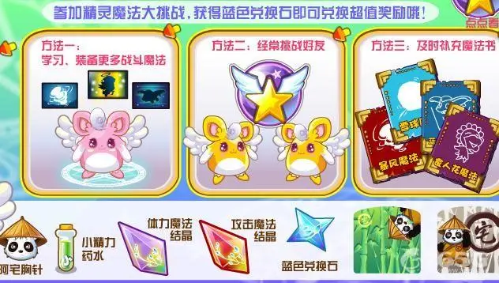 |
| --------------------------------------------- | --------------------------------------------- |

^
^

## 奥比岛手游小精灵

奥比岛手游中，小精灵可以学习魔法与其他玩家小精灵匹配进行战斗，但胜负随机。小精灵每日游戏可以获得一个“精灵果子”用于制作高级家具。

^

| 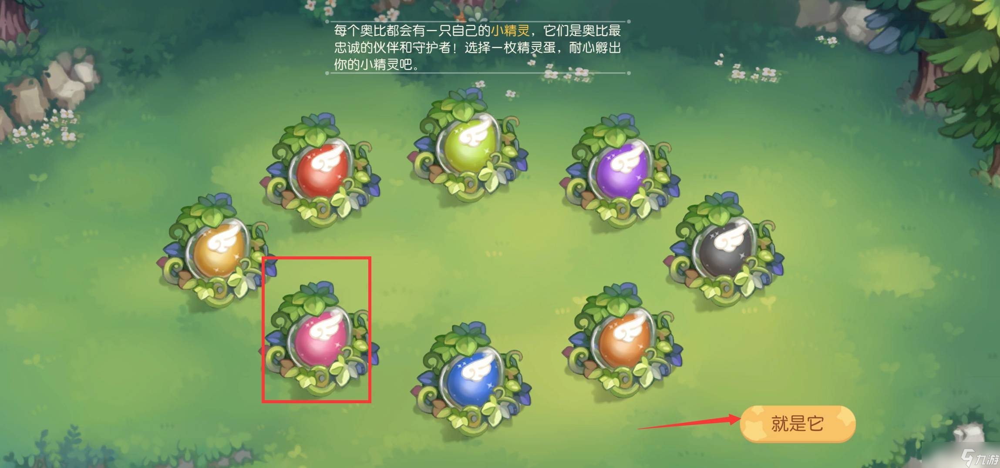 | 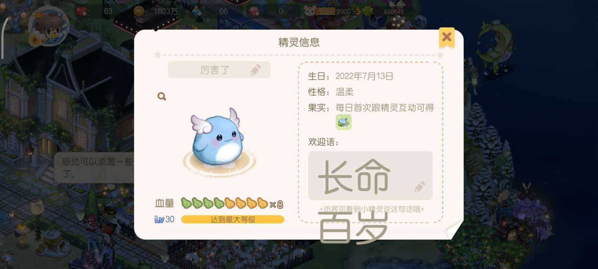 |
| --------------------------------------------- | --------------------------------------------- |
| 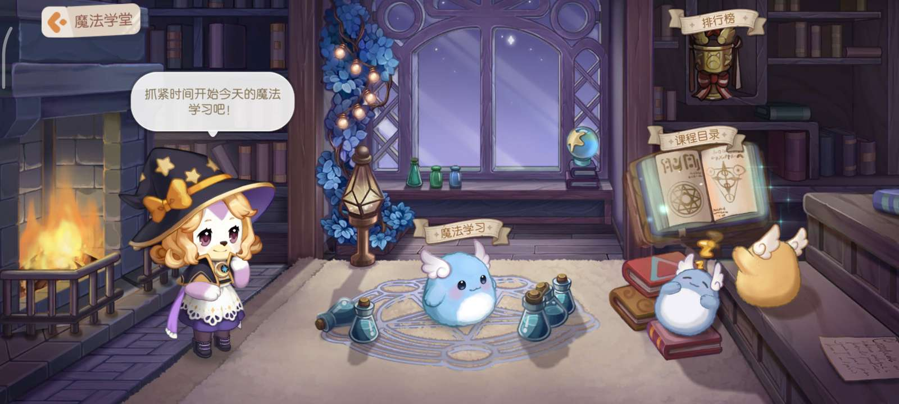 | 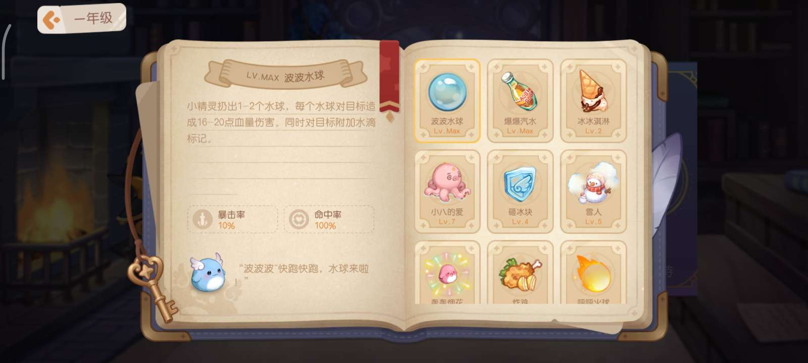 |

^
^

--: @百百伏特（B站）对本页有重要贡献

--: 本页最后修改时间：20230515
