:-: 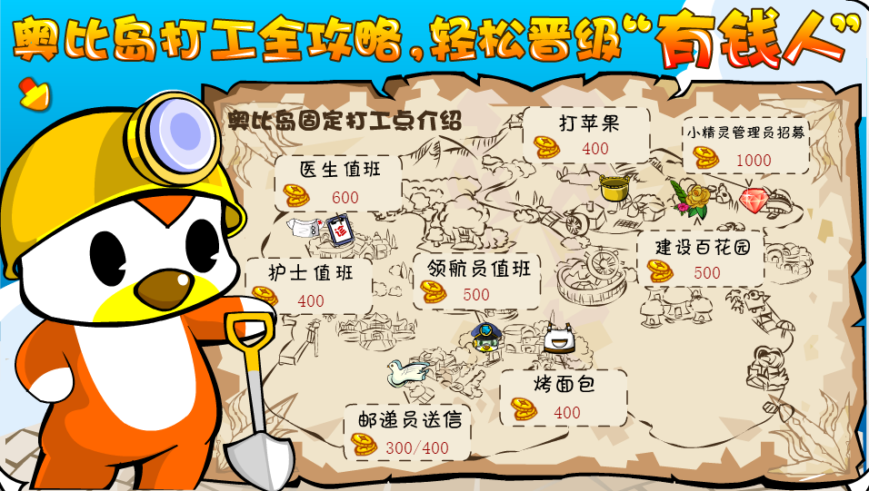

^

2012年之前，职业系统是奥比岛的核心玩法之一。小奥比化身各种职业参与打工、完成任务等等。一般打工方式为挂机1分钟。

^

## 远征军

:-: 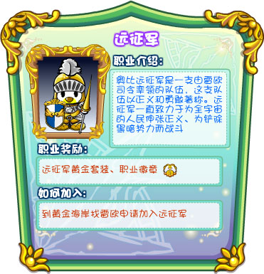

2009年6月，远征军计划强攻黑暗星球第一宫（金笛）。小奥比们前往阳光大道、黄金海岸可以参加“远征军召集”。

2010年4月，远征军计划前往王子星球，奥比岛远征军司令雷欧上任，前往奥比广场和王子星球可以报名成为远征军。

后来出了圣光骑士职业，远征军名存实亡。

^

:-: 

^

:-: 

^

## 领航员

:-: 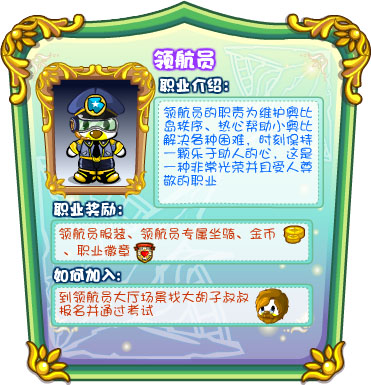

小奥比们通过考试即可成为领航员，职业等级最高2，分为领航员和明星领航员，巡逻100次可提升为明星领航员。

新手遇到问题时可呼叫领航员，领航员看到呼叫后会传送至对方位置并说出那句“**我是领航员 有问题问我**！”。

^

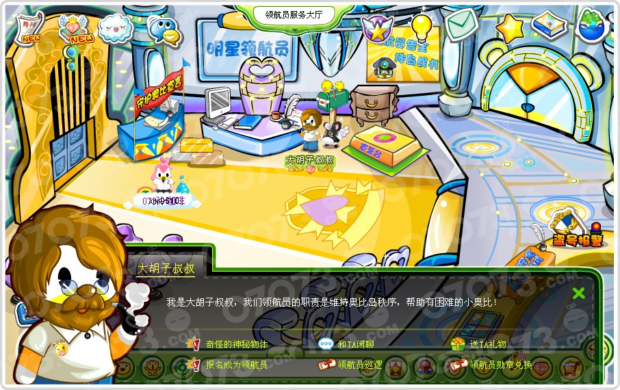

^

## 赏金猎人

:-: 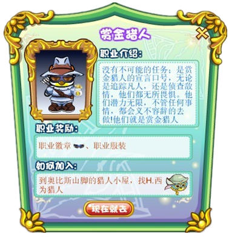

在猎人小屋找H·西接不同的任务，完成任务可获得令牌，令牌提升猎人等级解锁高级猎人服装，因猎人套装不可交易，故早期玩家很追捧高级猎人的服装。

^

:-: 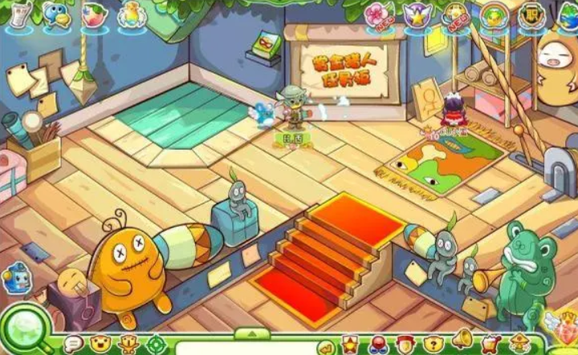

^

## 农场主

:-: 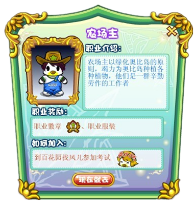

农场主也分为多个等级，配合最早的植物系统和蜜蜂系统获得积分提升等级。

^

:-: 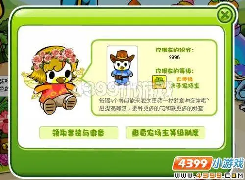

^

## 慈善家

:-: 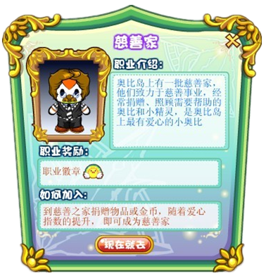

玩家可以在慈善之家捐献服装、家具、道具、房型等物品提升慈善家等级，获得相应图标和职业徽章。当年是最受奥比欢迎的功能之一。

^

:-: 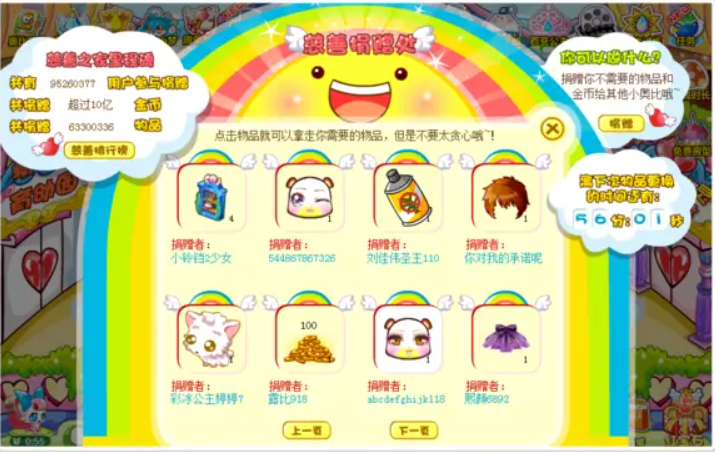

^

## 奥比特使

:-: 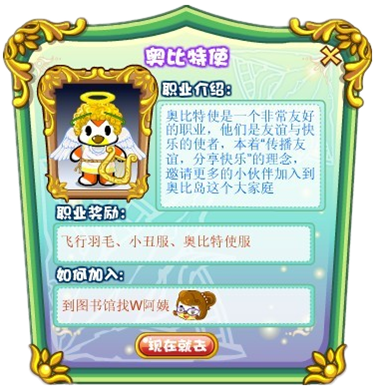

^

奥比特使的职责是邀请更多玩家来到奥比岛。邀请码在W阿姨旁边的抽屉里哦！

^

:-: 

^

## 建筑师

:-: 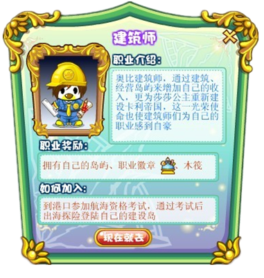

建筑师是卡利帝国篇章后诞生的出海职业玩法，玩家可在**卡利群岛**中建设自己的岛屿，随着等级的提升扩大，小岛解锁新家具（类似于现在的天际线、模拟城市等经营游戏）。

^

```[bilibili]
https://www.bilibili.com/video/BV1wG4y1C7zb
```

^

## 探险家

:-: 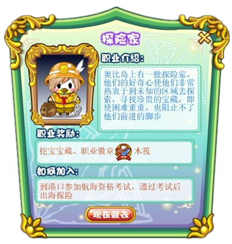

探险家也是卡利帝国篇章后诞生的出海职业玩法，有奥比身份上的职业等级和服装，但专属职业服装和徽章从未在游戏里产出，玩法上偏手游模式，用体力探索宝藏的位置，可挖出服装家具等“宝藏”。

^

:-: 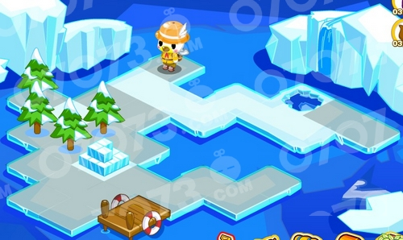

^

## 餐厅经理

:-: 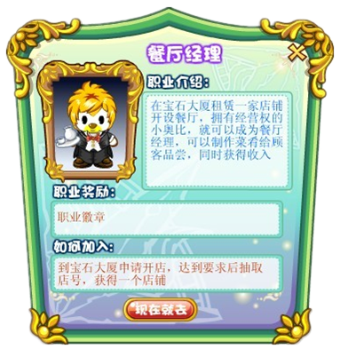

美食星的故事结束后，水颜公主在锦绣商业中心建立了宝石大厦，玩家可在这里开设自己的餐厅。配合厨师职业做菜给客人吃赚取金币，早期宝石大厦楼层限号抽取，职业等级提升后餐厅会越来越豪华。

^

:-: 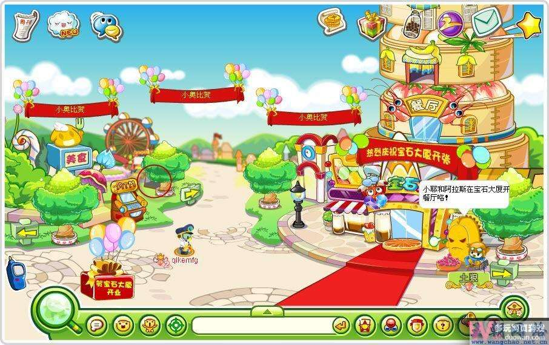

^

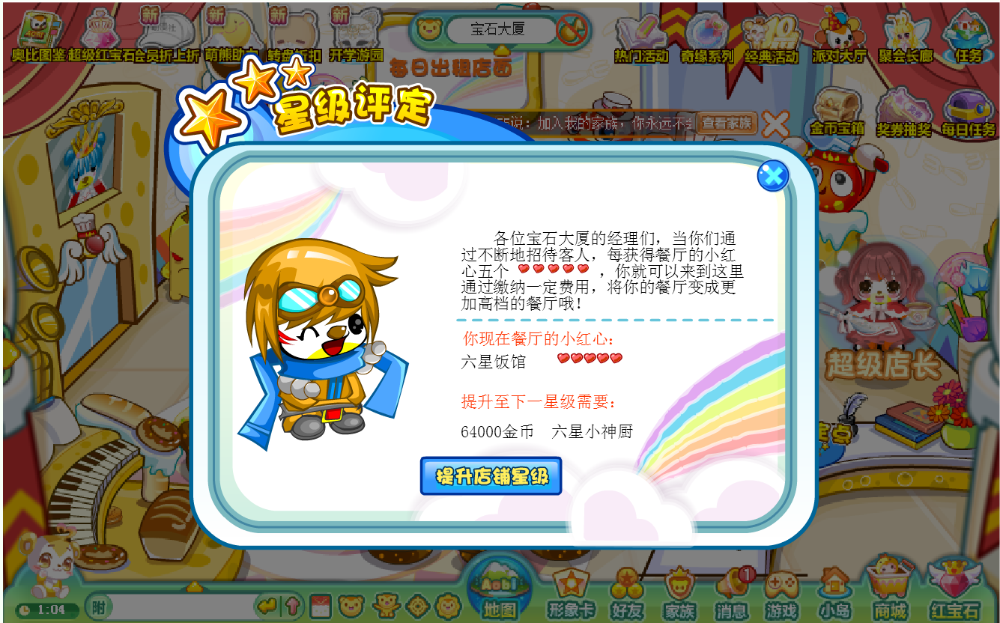

^

## 小神厨

:-: 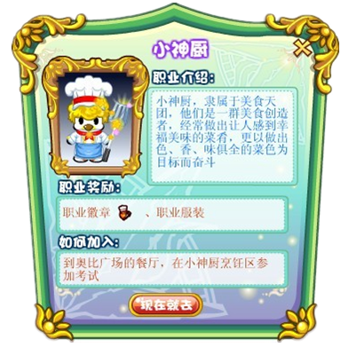

^

小奥比们可在厨神仓库购买食材/菜谱，食材也可通过各场景收集/种植获得，部分特殊菜谱通过任务获得比如美食星、苍月塔第四层，制作食材可提升厨师经验升级图标获得高级厨师服，早期做出的菜肴用于在美食星召唤怪物战斗使用，后期用于餐厅经理职业在宝石大厦使用。最受欢迎的职业之一。

^

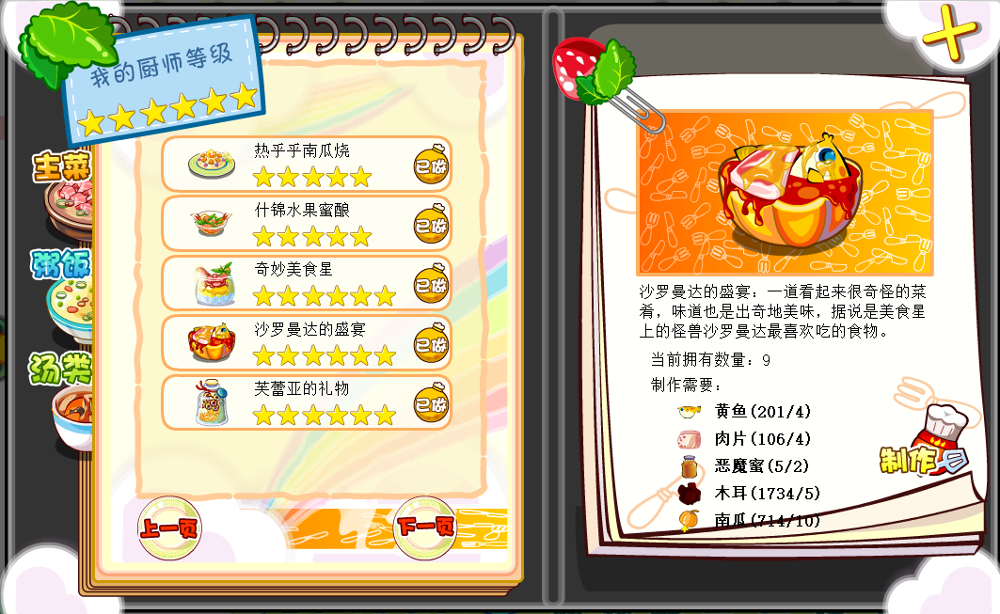

^

:-: 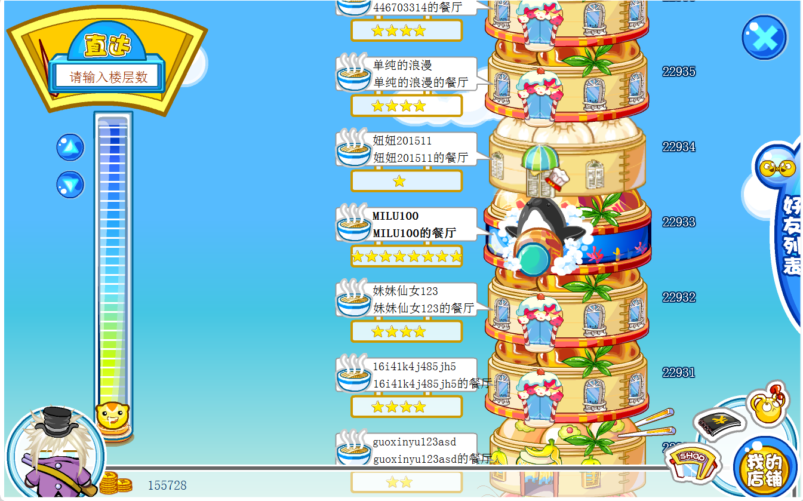

^

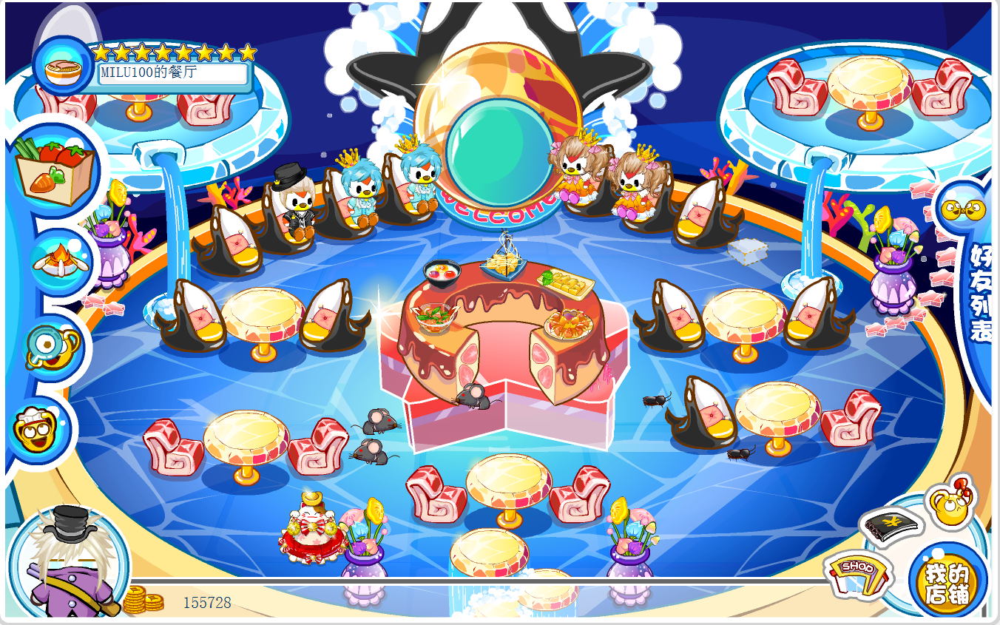

^

## 魔法使

:-: 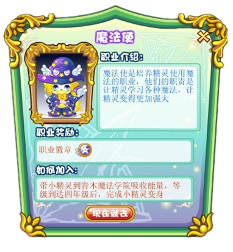

寻找阿拉斯通过魔法使认证，带上小精灵完成任务学习更多魔法。之后配套推出了魔法动物和动物园。

^

:-: 

^

## 医生

:-: 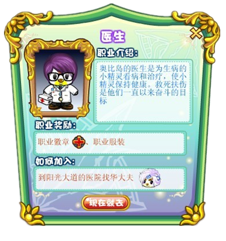

奥比岛的医生系统分成了三种不同的职业：出诊医生、坐诊医生、护士。本质上玩法没有不同，都是给小精灵看病，坐诊医生在医院等待玩家带生病的小精灵来看病，出诊医生则需要带上医药箱去其它玩家家里寻找生病的小精灵，无等级图标，单纯为打工赚取小红花等级和社交存在。

^

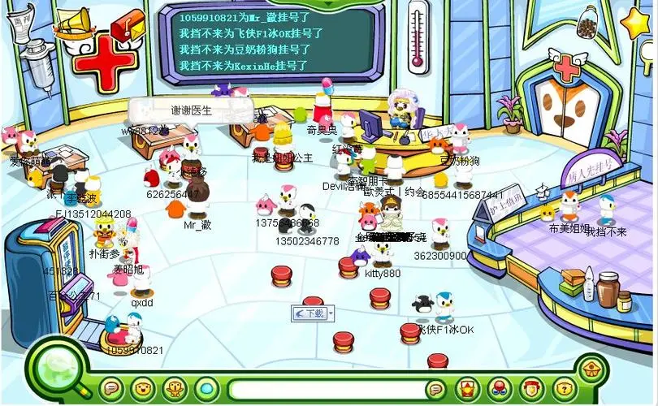

^

## 游戏王

:-: 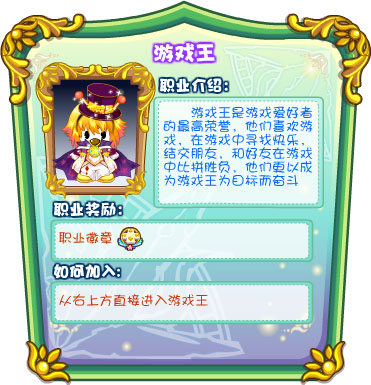

^

通过玩游戏获得积分。

^

:-: 

^

:-: 

^

## 超级模特

:-: 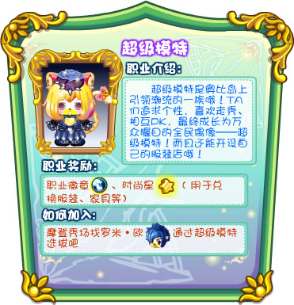

小奥比们化身模特，服装魅力值越高获得的时尚星就越多，玩家可保存搭配照到自己的花园家具。时尚星可兑换部分绝版服饰。

^


^


^

## 动物园长

:-: 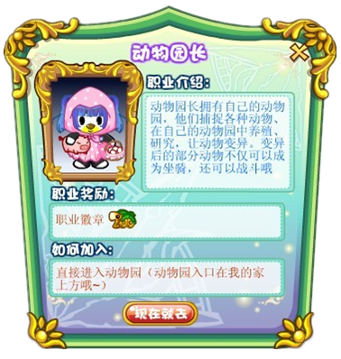

这是早期动物蜜蜂和qq星奶牛引出的系统玩法，玩家可开设动物园收集各种各样的动物让他们变异成为自己的坐骑/跟宠。玩家最早可通过妖精森林捕捉/打黑古拉的动物军团获得，后续产出方式为每周活动，2014年前基本一周一只新动物，现在两个月左右更新一只。 点击查看>>[动物图鉴](http://www.100bt.com/aobi/tujian-2/)

^

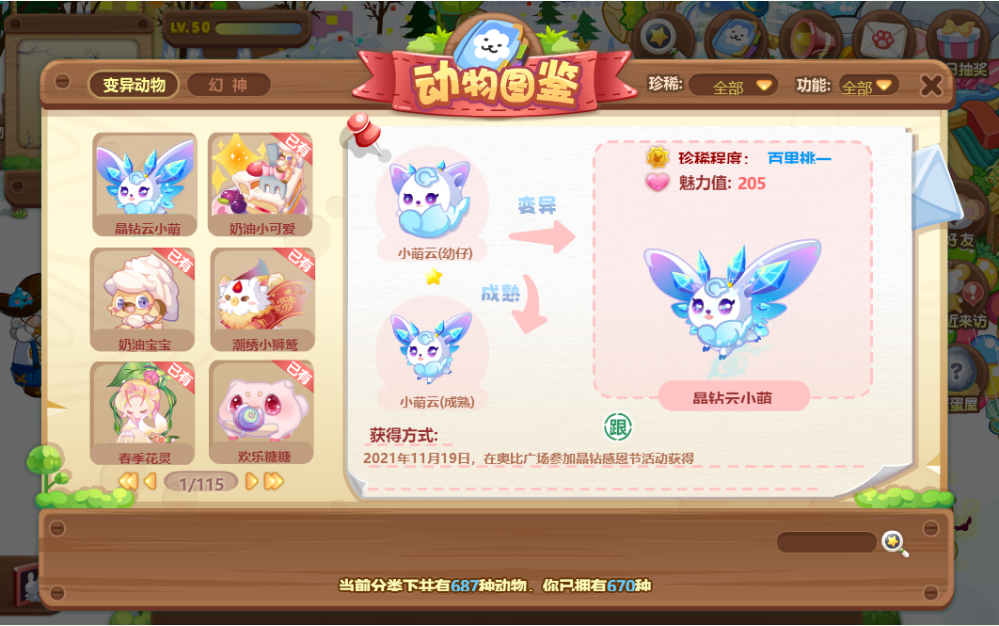

^

## 邮递员

:-: 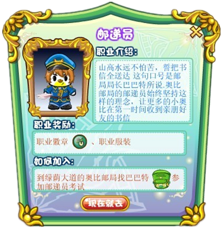

邮递员早期可给NPC送信完成任务，后面可通过提升等级前往中国站，地球站，给全世界送信获得当地特产服装/家具。是奥比岛最受欢迎的职业之一。

^

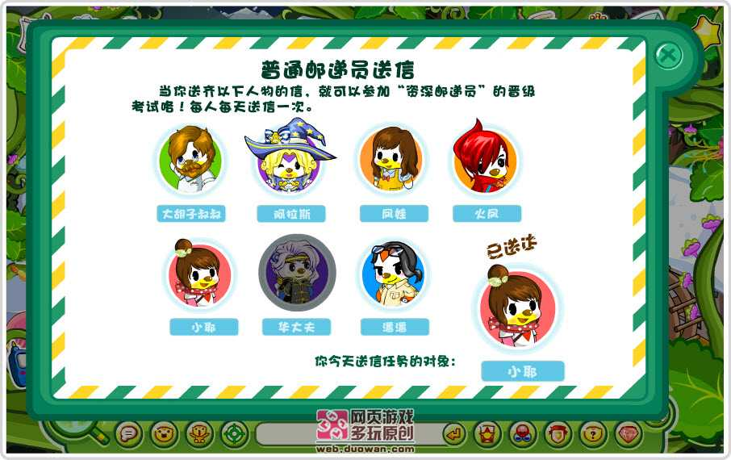

^

## 植物园园主

:-: 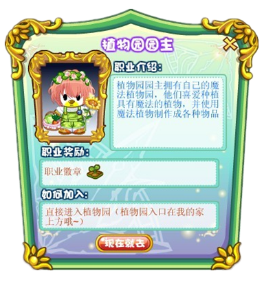

奥比们可以从植物园商店购买种子、道具、家具，种植魔法植物，同时装扮植物园。

^

:-: 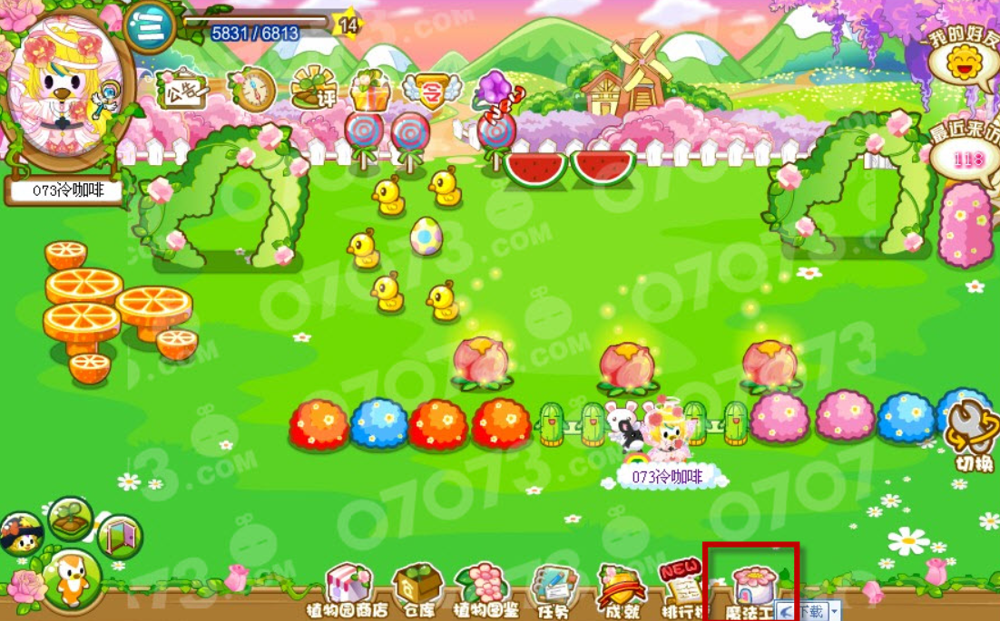

^

## 水族馆馆长

:-: 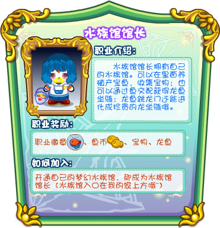

^

奥比们开启自己的水族馆，协助宝鱼鱼跃龙门成为龙鱼。（手游复刻了龙鱼）

^

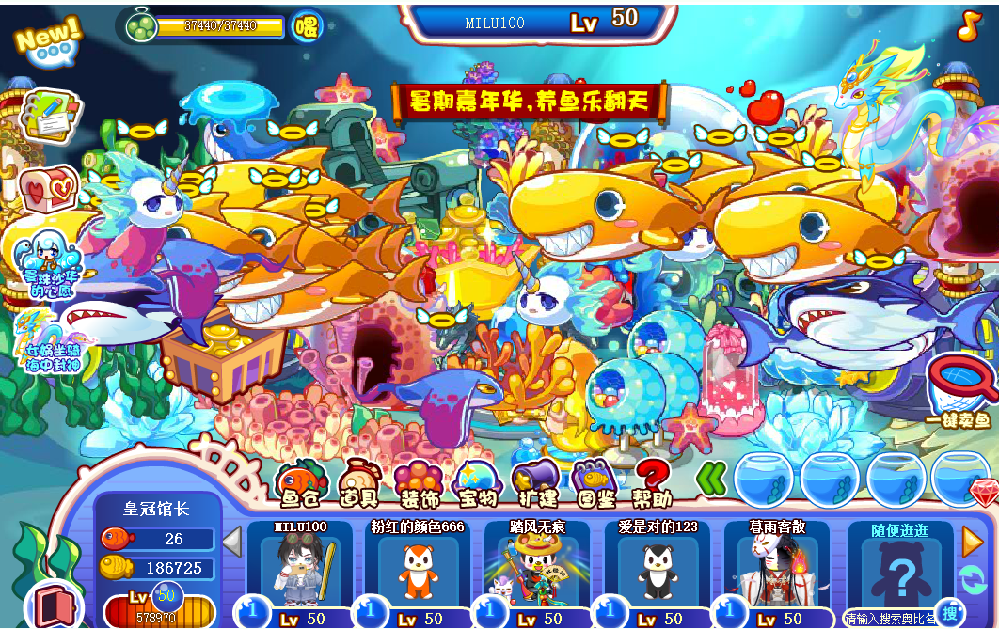

^

## 捕鱼师

:-: 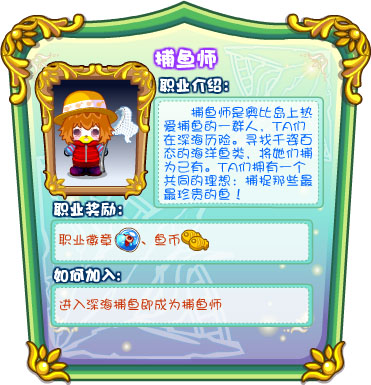

^

## 塔罗幻宠师

:-: 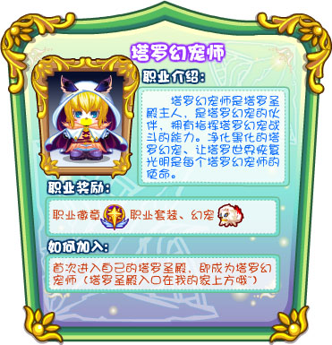

^

## 圣光骑士

^

:-: 

^

此外奥比岛还有服装店店长、SCC、PCC等职业，但存在时间较短。

^

:-: 

^

:-: 

^
^
^
^
^

--: @百百伏特（B站）对本页有重要贡献

--: 视频素材来自：@Mystey\_man\_（B站）

--: 本页最后修改时间：20230508
