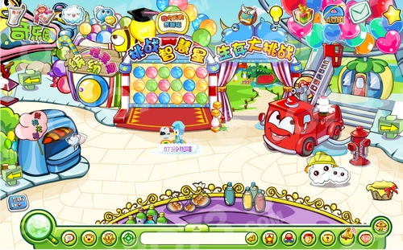
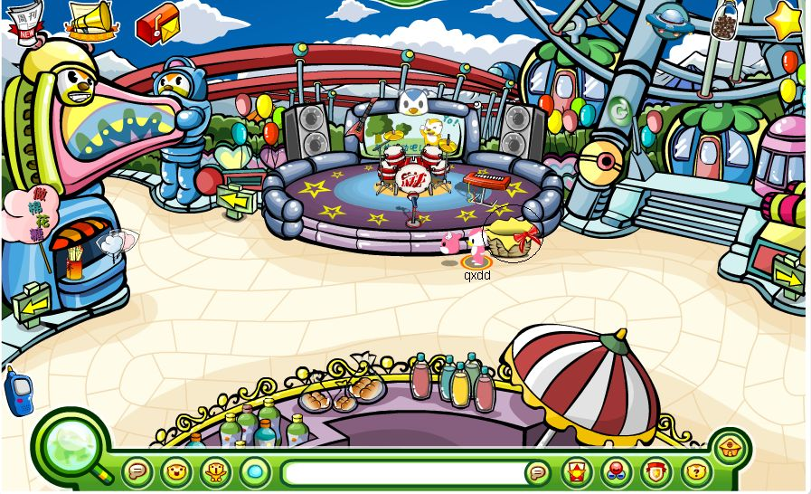
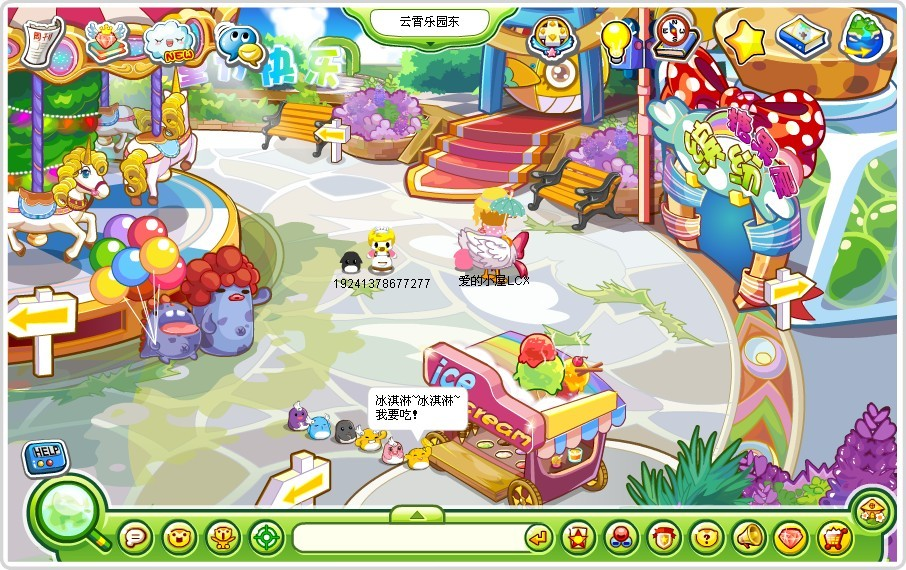
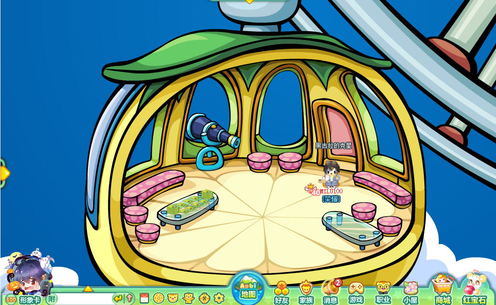
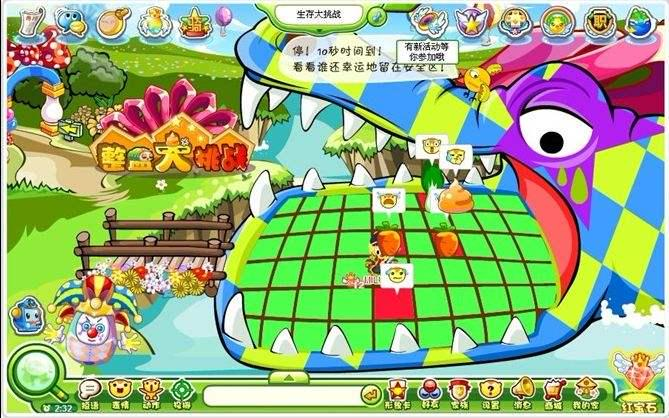
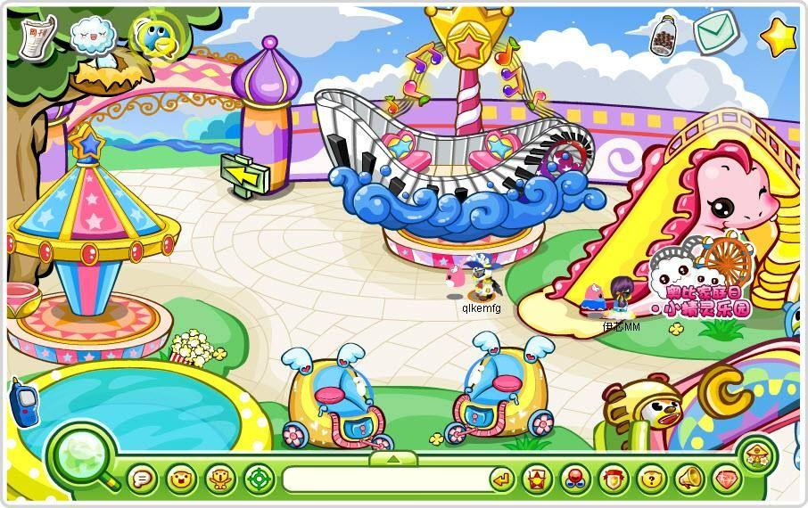

云霄乐园是一个放置各种小游戏的场景，早期黑超乐队会在这里演奏，之后演变成游戏场景。如今的云霄乐园改为了游戏乐园，专门放置一些小游戏。云霄乐园有三个二级场景，他们分别是摩天轮、鳄鱼嘴巴、奇乐园，后又推出“云霄乐园东”。

^

|  |  |
| --------------------------------------------- | --------------------------------------------- |
|  |  |
|  |  |

^

\*P4为摩天轮（现在仍可进）、P6为奇乐园。

^

--: @百百伏特（B站）对本页有重要贡献

--: 本页最后修改时间：20230516
