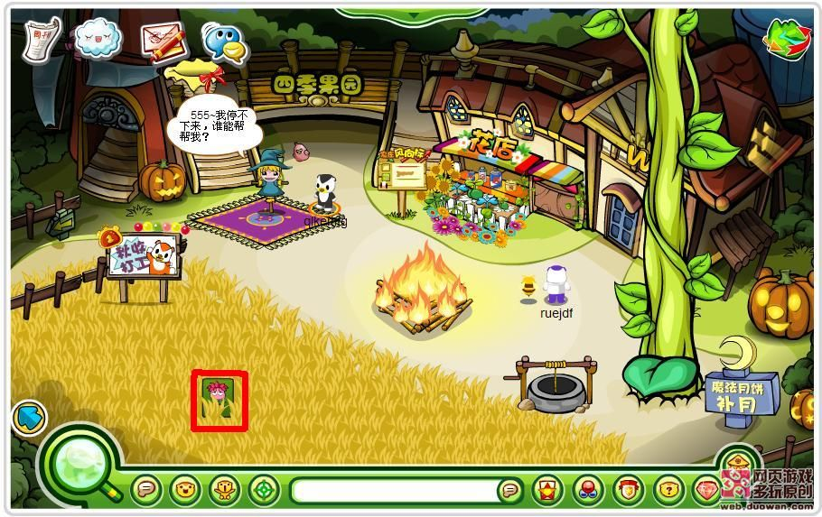
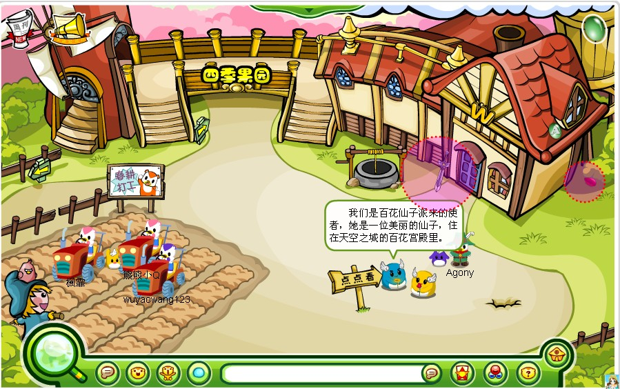
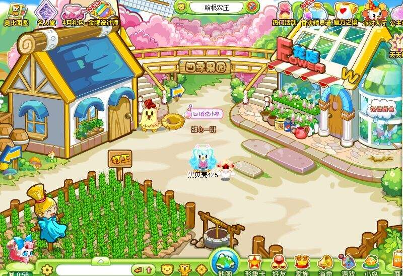
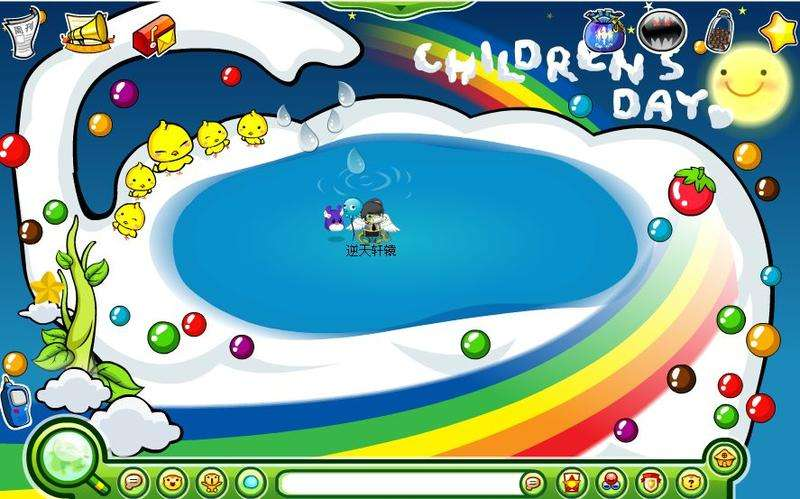
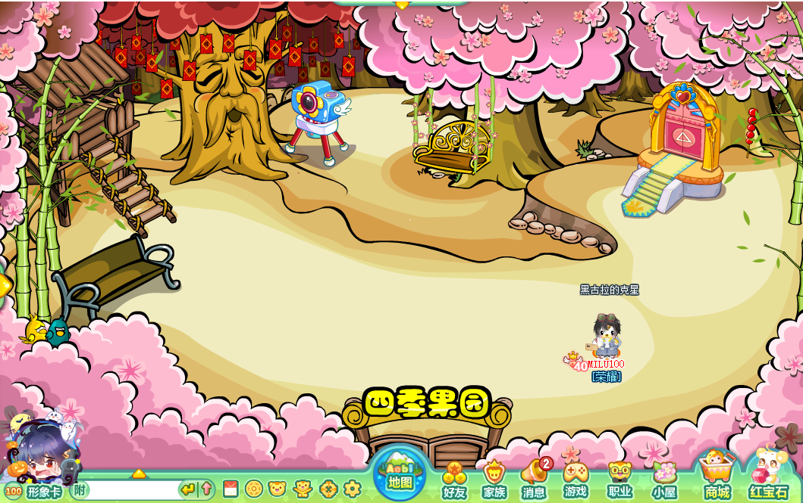
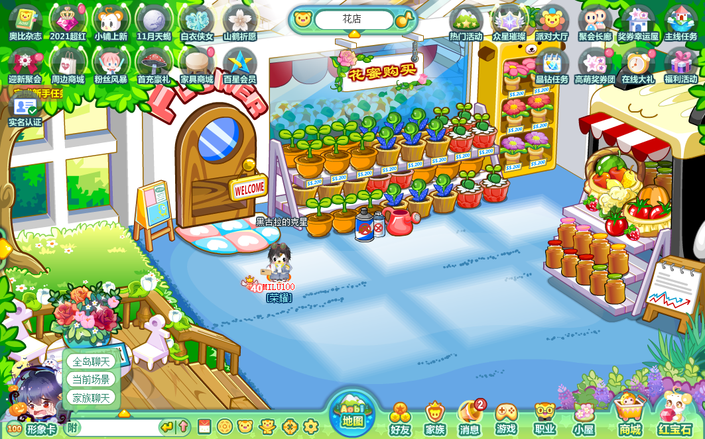
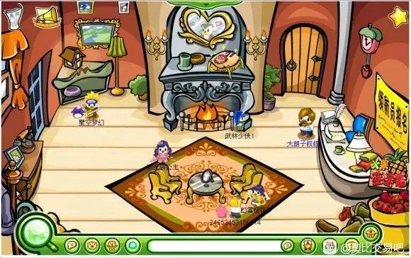
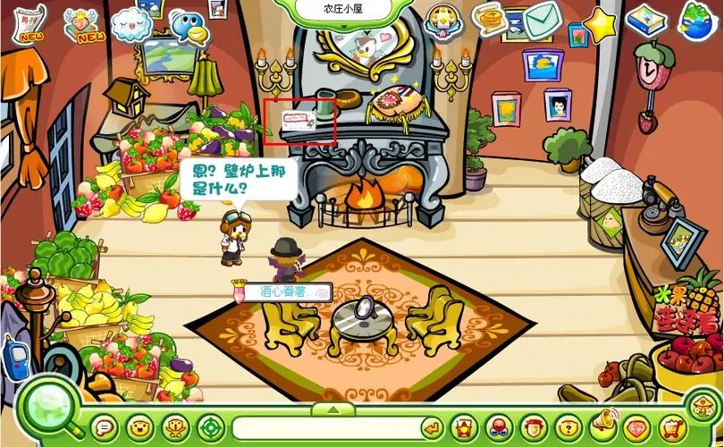

哈根农庄能产出一些资源，二级场景有花云、四季果园、花店、农庄小屋。“水井”“花云豌豆坑”“稻草人”“割麦子”“先有鸡还是先有蛋”是哈根农庄的关键词。

^

割麦子是奥比岛最受欢迎的打工点之一。

^

|  |  |
| --------------------------------------------- | --------------------------------------------- |
|  |  |
|  |  |
|  |  |

^
^
^

--: @百百伏特（B站）对本页有重要贡献

--: 本页最后修改时间：20230516
