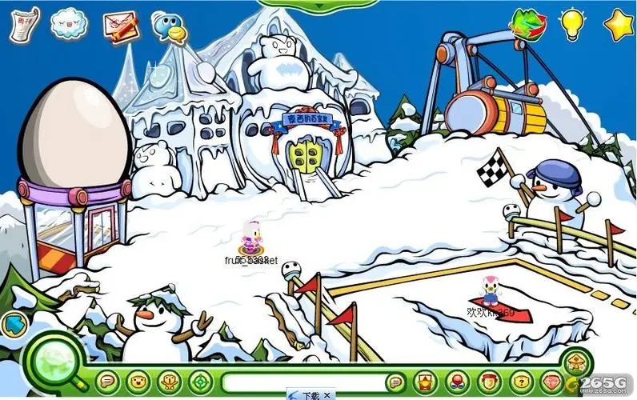
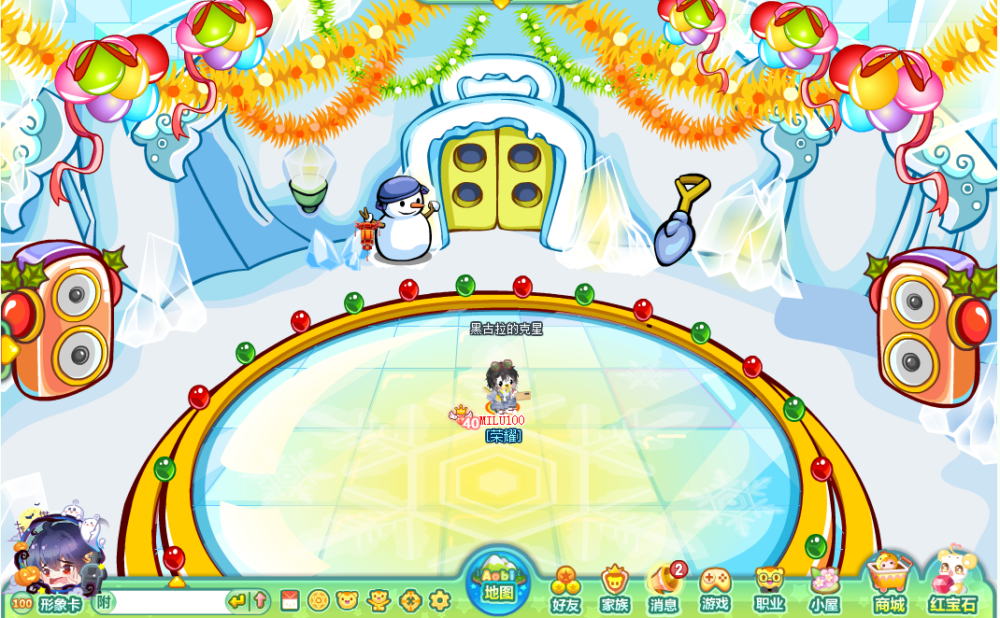
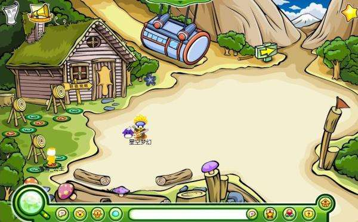
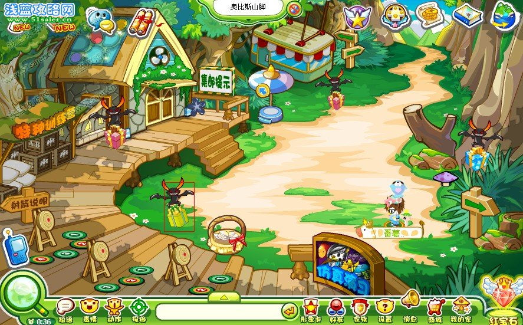
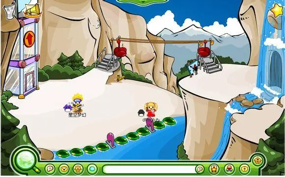
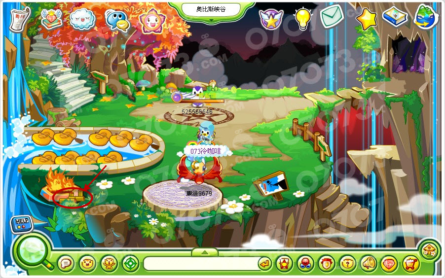

奥比斯山分为：奥比斯山顶、奥比斯山脚、奥比斯峡谷。

^

奥比斯山脚有特种训练、仿真演习、射箭三个小游戏。一个二级场景：猎人小屋。

奥比斯山顶有滑雪和缆车。一个二级场景：雪人城堡。雪人城堡至今仍可进入。

奥比斯峡谷（已取消）有缆车和漂流。可以进入山洞。

^

| 山顶 |  |  |
| -- | --------------------------------------------- | --------------------------------------------- |
| 山脚 |  |  |
| 峡谷 |  |  |

^
^

--: @百百伏特（B站）对本页有重要贡献

--: 本页最后修改时间：20230516
