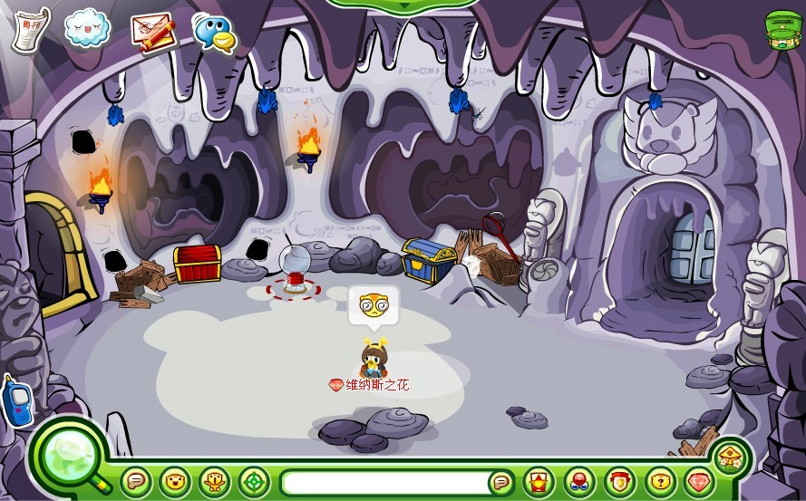
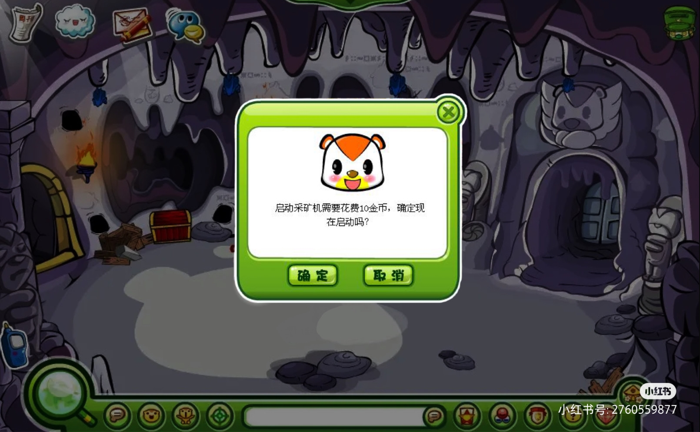
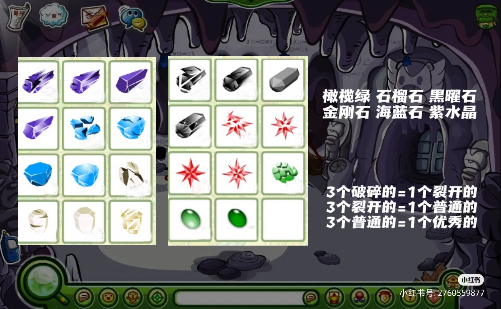
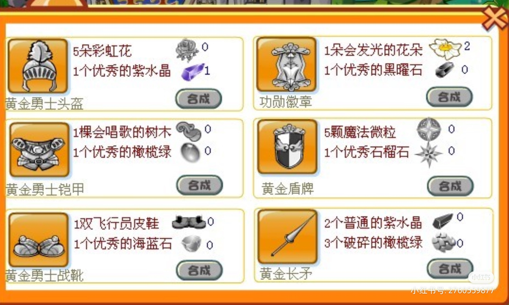

山洞是奥比岛的经典场景之一，小精灵学魔法期间山洞延伸出“挖宝石”功能。

^

通过采矿机可以挖到：橄榄绿、石榴石、黑曜石、金刚石、海蓝石、紫水晶。宝石可以用于完成任务，或找夜西进行交易（早期发家致富的快捷方式）。

^

|  |  |
| --------------------------------------------- | --------------------------------------------- |
|  |  |

^
^
^

--: 本页最后修改时间：20230515
