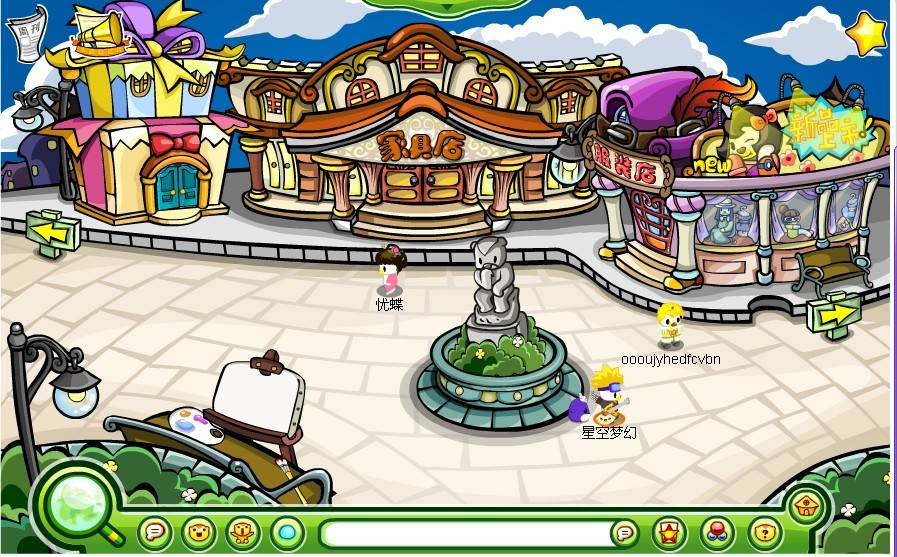
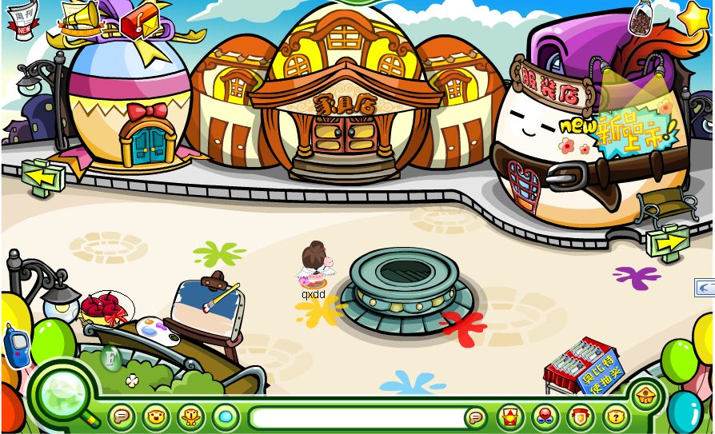
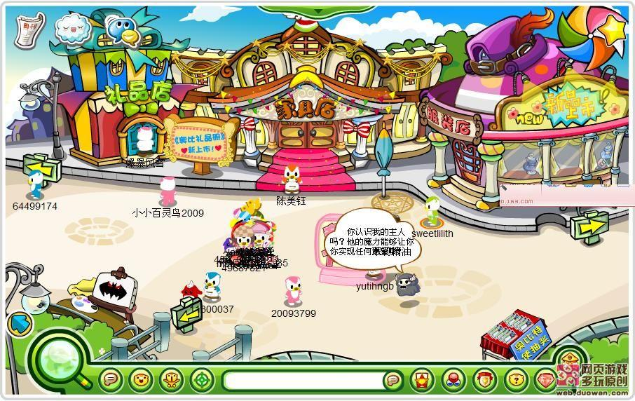
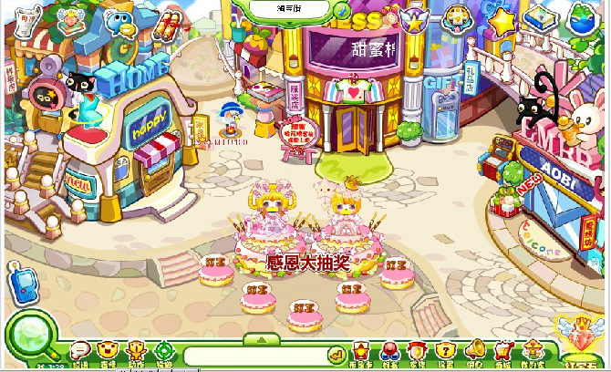
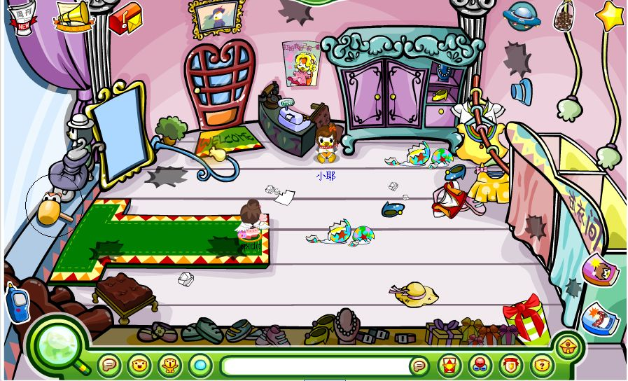
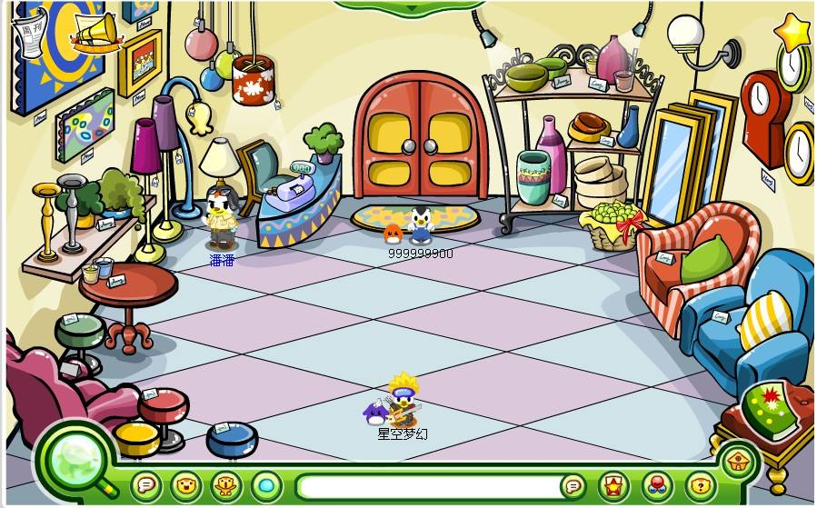
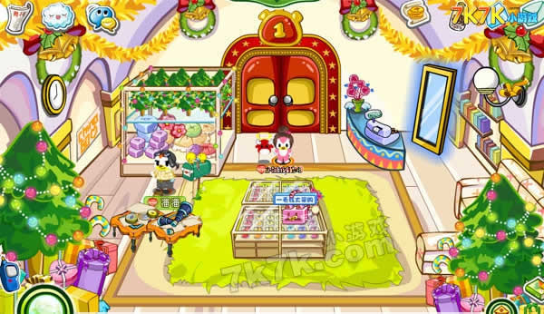
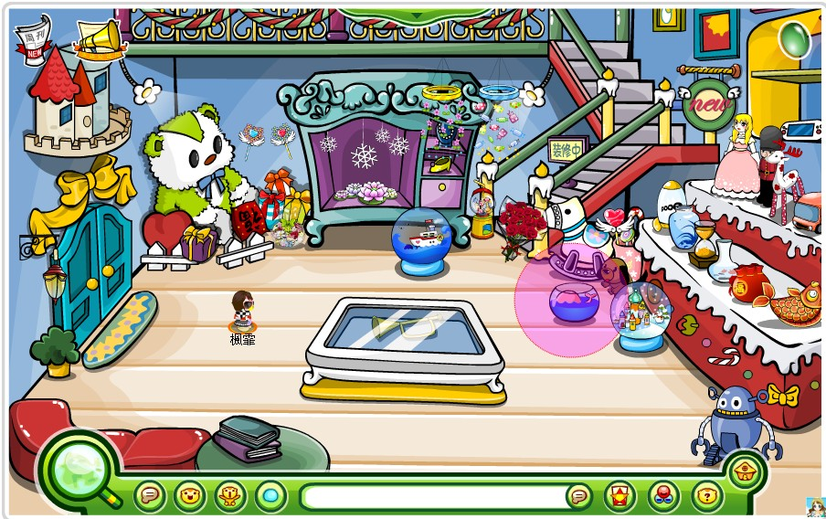
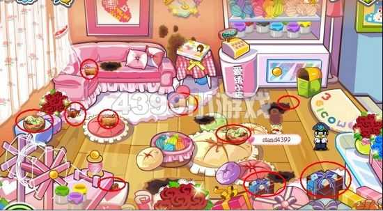

淘宝街是奥比岛最热闹的场景之一，小奥比们可以在这里进入服装店、家具店和礼品店。后期推出二楼。潘潘、小耶常驻在此场景。

^

现在的家具店和服装店保留了一些经典金币、晶钻服装和家具，其余的绝版服装、家具可以通过交易或交易大厅购买等方式获得。

^

| 2008 |                                               |
| ---- | ------------------------------------------------------------------------------------------ |
| 2009 |  |
| 2011 |                                               |
| 现在   |                                               |

^
^

服装店

|  |  |
| --------------------------------------------- | --------------------------------------------- |
|  |  |

^
^

家具店

|  |  |
| --------------------------------------------- | --------------------------------------------- |
|  |  |

^
^

礼品店

|  |  |
| --------------------------------------------- | --------------------------------------------- |

^
^

--: @百百伏特（B站）对本页有重要贡献

--: 本页最后修改时间：20230515
