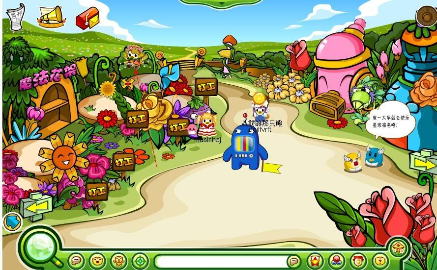
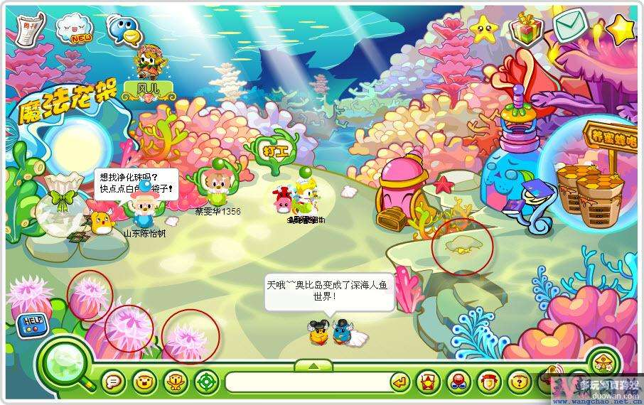
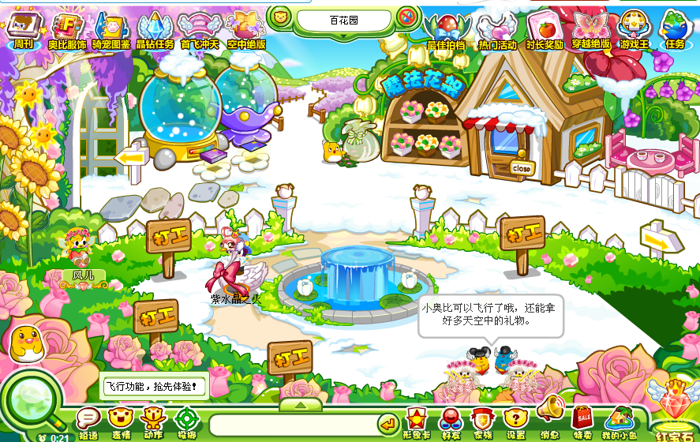

百花园中的“魔法花架”和“寻找七色花”都是最经典的副本任务，小奥比可以在这里打工、完成农场主考核、养蜜蜂等等。风儿和两只小精灵常驻在此场景。

^

| 早期场景 |  |
| ---- | --------------------------------------------- |
| 主题场景 |  |
| 经典场景 |  |

^
^

--: @百百伏特（B站）对本页有重要贡献

--: 本页最后修改时间：20230515
