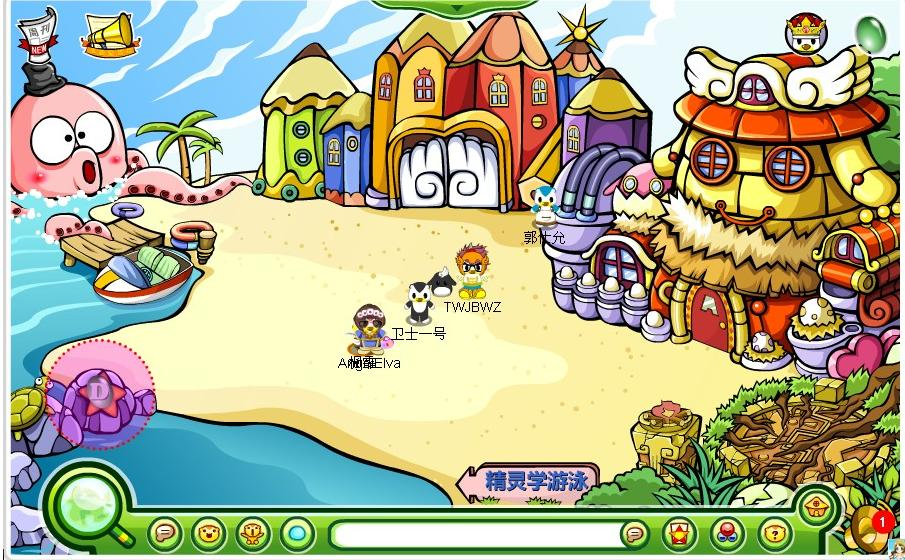
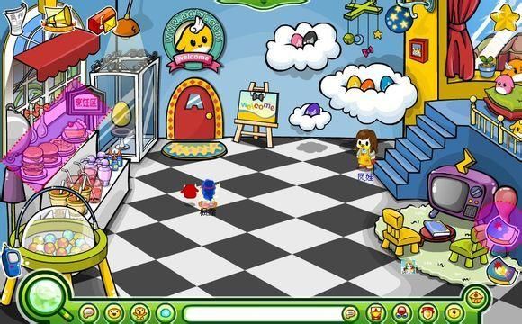
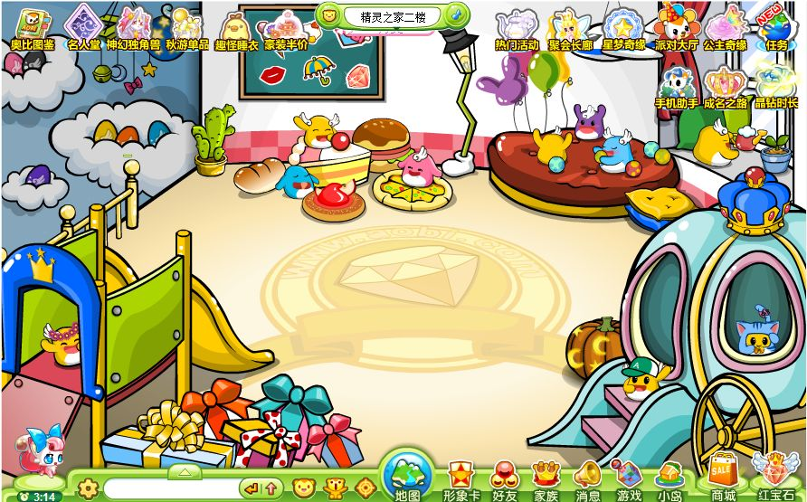
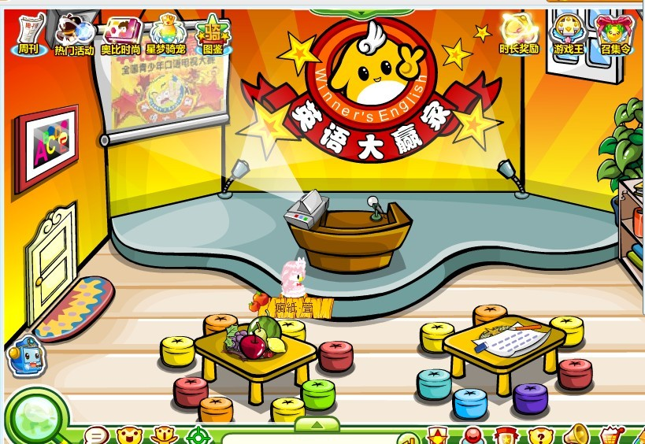
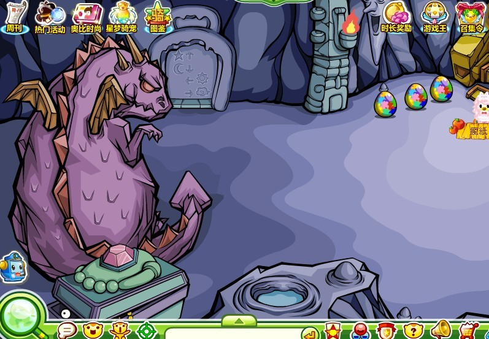

精灵岛是奥比们共同建造的一个场景，用于小精灵培养。二级场景有精灵学堂、精灵之家、地下洞穴。凤娃、鹦鹉教授、八爪鱼常住于此场景。现已取消。

^

更多玩法请阅读“新手指南——小精灵”。

^

| 精灵岛    |  |
| ------ | --------------------------------------------- |
| 精灵之家一楼 |            |
| 精灵之家二楼 |  |
| 精灵学堂   |  |
| 地下洞穴   |  |

^
^
^

--: @百百伏特（B站）对本页有重要贡献

--: 本页最后修改时间：20250403
