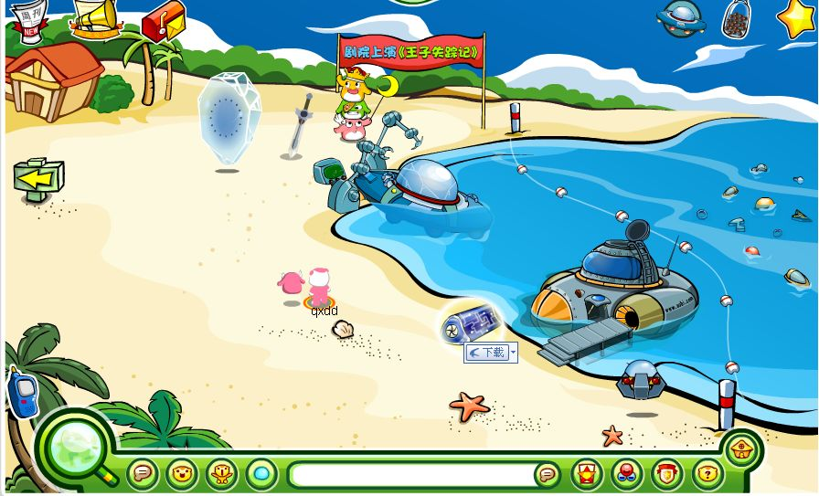
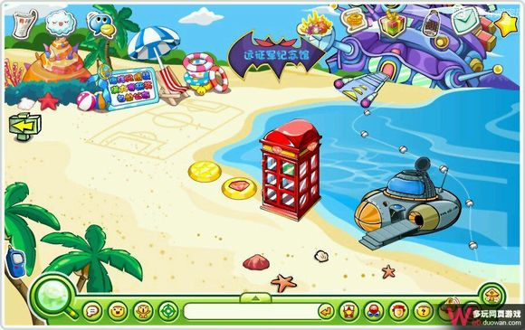
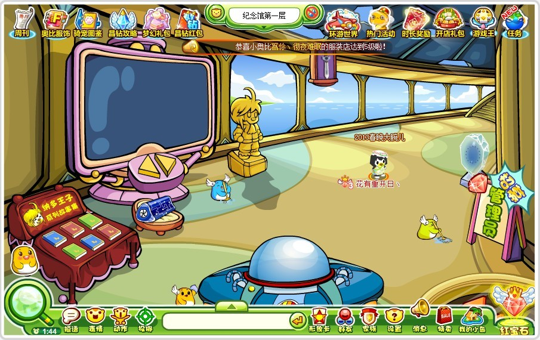
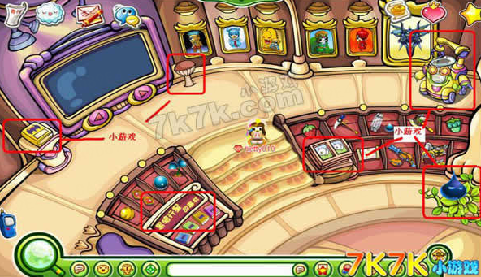
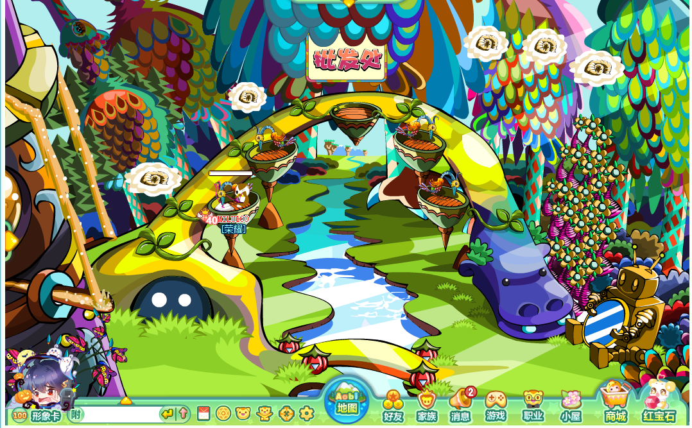
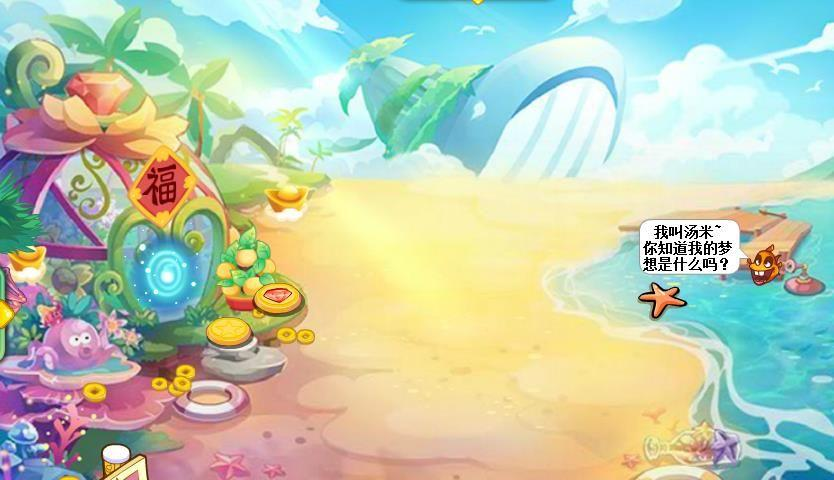

蔚蓝海岸是一个重要任务场景，早期以纳多王子和黑古拉为主，打败黑古拉后小奥比们将黑古拉坠落的堡垒建造成了**远征军纪念馆**，还有一个红宝石专门场景：**神秘世界**，地图右下角是小精灵游泳考试的地方。

^

神秘世界是红宝石岛民专属场景，普通玩家如果想进则需要在电话亭外等待红宝石岛民的邀请才可进入，点击场景中间的爪子会有一只大鸟送给红宝石岛民一颗摇钱树家具，还能在批发出卖服装赚钱，普通岛民也可在这里采集羊毛用在礼品店爱秀纺中。

^

> [info] 注：神秘世界有一个十几年未填的大坑“神秘世界深处”每次点它都会提示你“这出口好像还没开放呢”不知奥比岛是否是故意做了这种开放式结局，但因此也让神秘世界一直充满神秘和遐想……

^

现远征军纪念馆和游泳考试取消。

^

|  |  |
| --------------------------------------------- | --------------------------------------------- |
|  |  |
|  |  |

^
^

--: @百百伏特（B站）对本页有重要贡献

--: 本页最后修改时间：20230516
