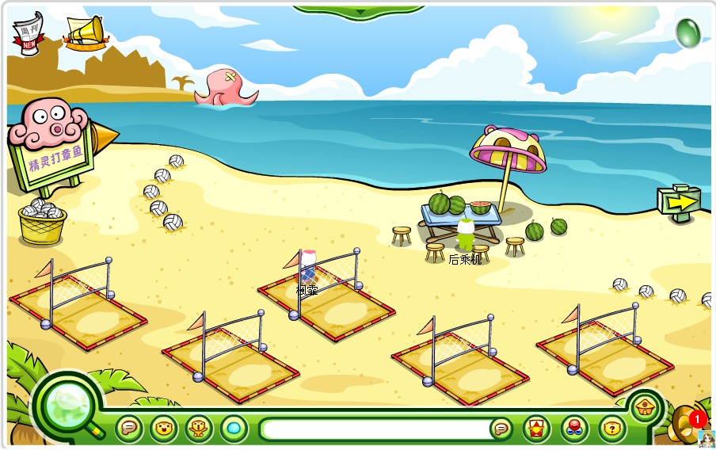
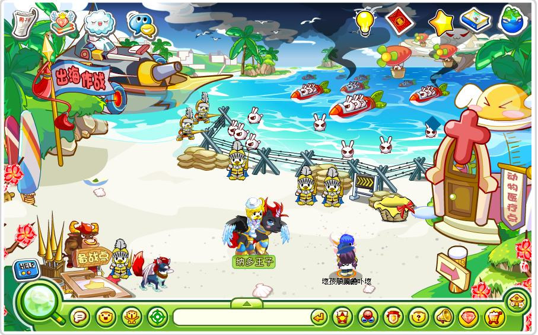

黄金海岸早期设置有“双人沙排”与“章鱼”，后作为海宝联动、远征军集结地。纳多王子和雷欧都曾常驻在此。

^

|  |  |
| --------------------------------------------- | --------------------------------------------- |
|  |  |

^
^

--: 本页最后修改时间：20230516
